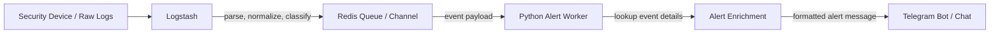
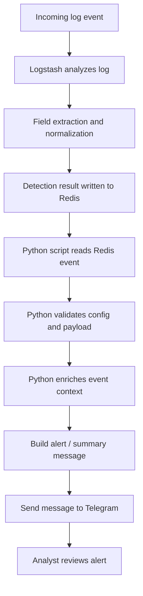
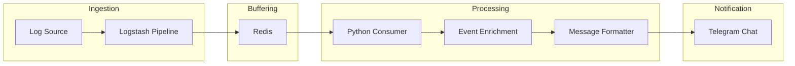

# MiniSOAR Program Flow

This document explains the current MiniSOAR runtime flow based on the project architecture:

`Logstash -> Redis -> Python Script -> Telegram`

## AI Session Code
- Claude : claude --resume e065865c-bc70-466c-80a6-4858df9e90e4
  
## High-Level Graph



## Runtime Flow



## Script Responsibility

### 1. Logstash
- Receives raw logs from the monitored source.
- Parses and normalizes fields.
- Detects or tags events that should become MiniSOAR alerts.
- Pushes the processed event into Redis for downstream handling.

### 2. Redis
- Acts as the handoff layer between ingestion and alerting.
- Stores the event temporarily so the Python worker can consume it.
- Decouples log analysis speed from Telegram delivery speed.

### 3. Python Script
- Reads alert events from Redis.
- Validates environment settings and event structure.
- Enriches the event with extra context when needed.
- Formats the final alert text for operational use.
- Sends the alert into Telegram.

### 4. Telegram
- Becomes the analyst-facing notification channel.
- Receives the formatted alert from the Python script.
- Allows operators to review the event quickly and continue response actions.

## Current Architecture View



## Refactored Package Architecture

MiniSOAR has now been refactored into a modular package structure under `minisoar/`:

- `minisoar/config.py` — centralized environment parsing, provider normalization, and Telegram config helpers.
- `minisoar/utils.py` — shared utility helpers for:
  - threat intelligence enrichment (`abuseipdb_lookup`, `ipapi_lookup`, `enrich_ip`, `enrich_multi_ip`)
  - whitelist/bypass checks
  - perimeter mapping lookup and telemetry log helpers
  - message formatting and Telegram delivery
- `minisoar/database.py` — Redis client, Elasticsearch indexing, event ID generation, and analyst label storage.
- `minisoar/mitigation/` — vendor-specific modules for Imperva, Palo Alto, and Akamai; `core.py` provides unified auto-block behavior.
- `minisoar/ml/` — ML inference, dataset export, and baseline training.
- `minisoar/daemon.py` — the Redis consumer loop, event enrichment, event indexing, ML recommendation, and alert broadcast logic.
- `minisoar/bot.py` — Telegram command handlers and callback handling for analyst-driven mitigation actions.

## Wrapper Entrypoints

The root-level executable scripts now act as thin wrappers only:

- `14_redis_telegram_alert.py` → calls `minisoar.daemon.main()`
- `09-tele-soar.py` → calls `minisoar.bot.main()`
- `export_dataset.py` → calls `minisoar.ml.export.main()`
- `train_baseline.py` → calls `minisoar.ml.train.main()`

This preserves the original operational entrypoints while keeping the core implementation inside the package.

## Legacy Cleanup

The following legacy transition files have been removed:
- `minisoar/legacy_alert_daemon.py`
- `minisoar/legacy_bot.py`
- `perimeter_mitigation.py`

Their responsibilities have been re-homed into the modular package files listed above.

## Testing

A pytest suite has been added under `tests/` with initial coverage for:
- config/provider normalization
- utility helpers
- ML inference fallback behavior
- mitigation mock flows
- event ID and timestamp parsing

Representative test files:
- `tests/test_config.py`
- `tests/test_utils.py`
- `tests/test_ml.py`
- `tests/test_mitigation.py`
- `tests/test_database.py`

### Mock Traffic Injection

To perform end-to-end operational testing without actual Logstash data, an analyst or developer can manually inject JSON payload directly into the Redis queue (`logstash_alert_queue`). This verifies the `minisoar.daemon` processing pipeline, ML scoring, and Telegram delivery.

Example execution (Windows PowerShell/Linux Terminal):
```bash
python -c "import redis, json, datetime; r = redis.StrictRedis(host='127.0.0.1', port=6379); payload = {'alert': {'type': 'alert_webshell_immediate', 'server_name': 'mock-target.com', 'src_ip': '8.8.8.8', 'method': 'POST', 'url': '/api/upload.php', 'status': '200', 'severity': 'high'}, 'tags': ['alert_webshell_immediate'], '@timestamp': datetime.datetime.now(datetime.timezone.utc).isoformat()}; r.lpush('logstash_alert_queue', json.dumps(payload)); print('Mock traffic berhasil dikirim ke Redis!')"
```

## Short Summary

MiniSOAR still works as an alert delivery and mitigation pipeline, but its implementation is now organized into a maintainable Python package. Logstash pushes alerts into Redis, `minisoar.daemon` consumes and enriches them, then broadcasts operational alerts to Telegram. Analysts interact through `minisoar.bot`, which issues mitigation actions through the vendor modules inside `minisoar/mitigation/`.

## Decision Log

### 2026-06-11 08:15 WIB
- **Problem:** `test_whitelist` in [test_utils.py](file:///c:/Users/rezy0/OneDrive%20-%20Kementerian%20Komunikasi%20dan%20Informatika/Documents/Kantor/Program/MiniSOAR/tests/test_utils.py) failed because `is_ip_whitelisted` expected 2 arguments (`ip` and `nets`), but was only called with 1 argument.
- **Solution:** Modified [test_utils.py](file:///c:/Users/rezy0/OneDrive%20-%20Kementerian%20Komunikasi%20dan%20Informatika/Documents/Kantor/Program/MiniSOAR/tests/test_utils.py) to supply a list of networks to the `is_ip_whitelisted` call in the test assertion.
- **Rationale:** The `is_ip_whitelisted` signature requires a subnet list parameter to determine matches cleanly without global state dependencies.

### 2026-06-11 12:40 WIB
- **Problem:** Linux installation command fails due to `externally-managed-environment` (PEP 668) restriction on Debian/Ubuntu modern distributions.
- **Solution:** Updated [Readme.md](file:///c:/Users/bandar/OneDrive%20-%20Kementerian%20Komunikasi%20dan%20Informatika/Documents/Kantor/Program/MiniSOAR/Readme.md) to split the Installation section into Windows and Linux, detailing the creation/activation of `.venv` and providing `--break-system-packages` override context.
- **Rationale:** Clean environment setup prevents package pollution and guarantees correct path resolution across deployment targets.

### 2026-06-11 13:55 WIB
- **Problem:** Operational request to add initial IP whitelist entries for Komdigi internal and trusted systems.
- **Solution:** Created [minisoar-whitelist.txt](file:///c:/Users/bandar/OneDrive%20-%20Kementerian%20Komunikasi%20dan%20Informatika/Documents/Kantor/Program/MiniSOAR/minisoar-whitelist.txt) in the workspace root containing all requested IP addresses and CIDR subnets.
- **Rationale:** Separating IP whitelist into a dedicated text file prevents configuration clutter in `.env` and allows easy, plain-text additions.

### 2026-06-12 14:00 WIB
- **Problem:** Frequent immediate commits/activations on Palo Alto and Akamai under AUTO/SEMI mode can overload firewall CPUs and exceed edge network API limits.
- **Solution:** Extracted commit logic into a standalone `trigger_commit` method and added a `commit=False` parameter option to `trigger_auto_block`. Modifed the daemon loop in [daemon.py](file:///c:/Users/rezy0/OneDrive%20-%20Kementerian%20Komunikasi%20dan%20Informatika/Documents/Kantor/Program/MiniSOAR/minisoar/daemon.py) to queue pending commits and execute them in batches at configurable intervals (defined by `MINISOAR_COMMIT_INTERVAL`, defaulting to 1 hour).
- **Rationale:** Rate-limiting WAF/firewall config applications to batch schedules prevents API rate-limiting and CPU exhaust on the firewalls while maintaining fast IP additions to candidate configurations.

### 2026-06-12 14:20 WIB
- **Problem:** Logstash configuration files (`minisoar-perimeter.yml` and `minisoar-whitelist.yml`) clutter the repository root, confusing developers and complicating production deployment to `/etc/logstash/`.
- **Solution:** Relocated both `minisoar-perimeter.yml` and `minisoar-whitelist.yml` into the `logstash/` directory of the repository. Added `minisoar-whitelist.yml` to the git staging area, updated the `Readme.md` structure tree and config table, and verified path resolutions in the Python daemon.
- **Rationale:** Grouping all files deployed to `/etc/logstash/` on the server under the `logstash/` folder in the repository makes the project directory structure cleaner and ensures direct, correct deployment configurations.

### 2026-06-12 14:30 WIB
- **Problem:** Permanent blocking of attacker IPs on security perimeters can lead to blocklist bloat, security rule limit exhaustion, and accidental blocks of dynamic/shared user IPs (false positives).
- **Solution:** Implemented temporary blocking with dynamic extensions. Initial blocks last for 10 minutes (configurable via `MINISOAR_BLOCK_DURATION`, default 600s). If an active block receives subsequent attack events, the daemon extends the block duration by another 10 minutes from the time of the latest attack. Expiry timestamps are tracked using a Redis Sorted Set (`minisoar:pending_unblocks`). The daemon periodically checks for expired entries, issues atomic unblocks, and notifies the analyst channel.
- **Rationale:** Restricting perimeter blocks to a transient state reduces rule clutter and automates cleanup, while the sliding extension window ensures active threats remain blocked as long as the attack continues.

### 2026-06-12 14:45 WIB
- **Problem:** Running wrapper scripts (like `scripts/export_dataset.py` or `scripts/train_baseline.py`) from inside the `/scripts/` directory fails to load the project `.env` and reads/writes the dataset CSV to the wrong directory because `Path.cwd()` was used for resolution.
- **Solution:** Updated `minisoar/config.py`, `minisoar/ml/export.py`, and `minisoar/ml/train.py` to resolve `.env`, `dataset.csv`, and `baseline_model.joblib` paths dynamically using `Path(__file__)` relative to the package files instead of `Path.cwd()`.
- **Rationale:** Location-independent path resolution ensures the package can be executed or imported from any working directory while maintaining access to the centralized configuration and dataset files in the project root.

### 2026-06-12 15:05 WIB
- **Problem:** When an alert is detected on a website that is unmapped/unknown in the perimeter configuration, auto-mitigation block rules would skip it entirely, leaving the origin server exposed to attacks.
- **Solution:** Configured a catch-all route inside the `AUTO` and `SEMI` mitigation blocks: if the perimeter is unmapped (`mapped` flag is False), and the AI makes a high-confidence block prediction, the daemon falls back to issuing a temporary block on Imperva only (`["imperva"]`).
- **Rationale:** Falling back to Imperva as a default global security barrier for unmapped systems ensures active threats are mitigated immediately while preventing rule injection on incorrect perimeter firewalls.

### 2026-06-12 15:40 WIB
- **Problem:** When an alert is blocked on Imperva only (e.g. for unmapped websites), the Telegram broadcast notification erroneously states "Commit pending", even though Imperva updates take effect immediately and do not require scheduled batch commits like Palo Alto and Akamai.
- **Solution:** Modified the daemon alert string builder to evaluate if any target perimeter in the block group requires a commit (`paloalto` or `akamai`). If not, it omits the "Commit pending" string and displays a direct "Temporary block" status.
- **Rationale:** Making the pending commit flag conditional prevents confusion for security analysts and accurately reflects the real-time blocking status of the perimeter devices.

### 2026-06-15 13:25 WIB
- **Problem:** Operational requirement to establish static code analysis (SonarQube) in GitLab CI/CD pipelines to ensure code maintainability, security, and cleanliness.
- **Solution:** Added a `.gitlab-ci.yml` pipeline configuration file defining the `sonarqube-check` job which runs the official `sonarsource/sonar-scanner-cli` image.
- **Rationale:** Centralizing security scanner integration within the GitLab CI pipeline provides automated quality gates on each repository push, preventing regression and identifying code quality issues early.

### 2026-06-15 14:50 WIB
- **Problem:** In `AUTO` and `SEMI` modes, whitelisted IPs were still blocked if the ML model predicted them as malicious with high confidence (e.g. 95% for 10.2.57.246).
- **Solution:** Added a check for `whitelisted` in both `AUTO` and `SEMI` code blocks in `minisoar/daemon.py` to bypass any auto-blocking logic and explicitly label the AI response as `ALLOW (Whitelisted)`.
- **Rationale:** The whitelist is a hard security guarantee that should override any AI predictions to prevent critical false positives on trusted internal and corporate IPs.

### 2026-06-15 15:25 WIB
- **Problem:** Need to configure specific GitLab Runner tags, build cache, Quality Gate wait, and branch restrictions for the SonarQube CI/CD pipeline.
- **Solution:** Updated `.gitlab-ci.yml` by adding `tags: - sonar-scanner`, caching rules for `.sonar/cache`, quality gate parameter `-Dsonar.qualitygate.wait=true`, and `only: - dev` rule.
- **Rationale:** Restricting pipeline executions to the `dev` branch prevents redundant runs, while build caching and specific runner tags optimize build execution time and runner utilization.

### 2026-06-18 14:45 WIB
- **Problem:** Codebase lacks automated security scans, formatting/linting checks, static typing analysis, and testing pipelines on GitLab CI, and there is no equivalent configuration for GitHub Actions.
- **Solution:** Added a modular pipeline setup containing `security` (Gitleaks, Bandit), `lint` (Ruff, Mypy), and draft `test` (Pytest) stages to `.gitlab-ci.yml`. Concurrently, created an equivalent GitHub Actions workflow configuration in `.github/workflows/ci.yml`. All jobs and workflows are configured to run with manual triggers only (`when: manual` in GitLab, and `workflow_dispatch` in GitHub Actions) per user instructions.
- **Rationale:** Separating scans into individual jobs provides parallelization, immediate and clear error reporting, and allows non-blocking verification for draft test suites. The manual triggering prevents runner resource wastage and aligns with development flow preferences.

### 2026-06-23 23:27 WIB
- **Problem:** For unmapped sites, the alert buttons are not displayed so analysts cannot block on Imperva via buttons, and analysts can still manually block on Palo Alto or Akamai using bot commands which is incorrect according to SOP.
- **Solution:** Modified `daemon.py` to pass overridden `providers` (restricting to `["imperva"]`) when sending unmapped domain alerts to Telegram. Modified `bot.py` commands (`blockonpalo`/`blockonakamai`/`unblockonpalo`/`unblockonakamai`) and callback query handlers to query Elasticsearch for the site domain, and redirect unmapped domains to block/unblock on Imperva instead.
- **Rationale:** Restricting blocking target selection and enforcing fallback behavior on both UI buttons and backend handlers guarantees unmapped perimeters are only mitigated on Imperva, preventing operational errors.

### 2026-06-26 15:05 WIB
- **Problem:** Operational decisions for manual bot commands and automated daemon blocking were not saved to Elasticsearch, leading to inconsistencies when exporting datasets via `minisoar/ml/export.py`.
- **Solution:** Integrated `store_label` inside manual commands in `minisoar/bot.py` (fetching the closest `event_id` via `es_find_latest_event_id_by_ip`) and inside auto/semi-auto modes in `minisoar/daemon.py`.
- **Rationale:** Writing all blocking decisions to the labels index prefixed with `minisoar-labels` ensures the dataset extraction queries run by `export.py` capture the full decision-making history of the SOAR platform.

### 2026-08-18 10:50 WIB
- **Problem:** Hardcoded mitigation logic in daemon made it difficult to customize workflow triggers for specific threat categories (e.g. webshell, bruteforce, sqli), and alert bursts from repeated attacks risked flooding analysts with notifications.
- **Solution:** Implemented **Tier 2: Declarative Playbook Engine** (`minisoar/playbook/`) supporting YAML-defined workflows (`minisoar/playbooks/`), safe AST condition evaluation, DAG step execution, and fallback handling. Concurrently added **Alert Correlation & Anti-Spam Engine** (`minisoar/correlation.py`) providing Redis-backed sliding-window hit aggregation, alert storm throttling, and multi-IP campaign detection.
- **Rationale:** Separating orchestration rules into declarative YAML files allows rapid tuning of mitigation playbooks without touching core code, while correlation and throttling prevent alert fatigue during sustained distributed attacks.

### 2026-08-18 10:55 WIB
- **Problem:** MiniSOAR previously only supported perimeter WAF/firewall mitigations (Imperva, Palo Alto, Akamai) without direct capability to contain internal compromised hosts or register IoCs at the endpoint level.
- **Solution:** Integrated EDR servers via a dedicated `minisoar/edr/` package: **Kaspersky Security Center (KSC 15.1 OpenAPI)** and **TrendMicro (Cloud One Workload Security & Vision One)** APIs. Implemented unified host containment (`isolate_endpoint`, `restore_endpoint`), IoC registration (`add_edr_ioc`), endpoint querying, Telegram bot commands (`/isolatehost`, `/restorehost`, `/queryhost`, `/addedrioc`, `/edrstatus`), and Playbook actions (`edr.isolate_endpoint`, `edr.add_ioc`).
- **Rationale:** Providing unified host containment across Kaspersky and TrendMicro enables instant response to ransomware, lateral movement, and internal asset compromises directly from SOAR playbooks and Telegram operations.

### 2026-08-18 11:35 WIB
- **Problem:** MiniSOAR should not enforce a heavy mandatory internal ticketing database. Instead, incident ticketing must integrate with enterprise 3rd-party applications (TheHive, Jira, ServiceNow, Generic Webhook) and remain strictly optional based on configuration.
- **Solution:** Implemented **Tier 3: Modular & Optional 3rd-Party Ticketing Connectors** (`minisoar/cases/connectors.py` & `minisoar/cases/core.py`).
  - Controlled by `TICKETING_PROVIDER` (`none` [default/disabled], `thehive`, `jira`, `servicenow`, `webhook`).
  - When disabled (`none`), MiniSOAR processes alerts and mitigations seamlessly without ticketing overhead.
  - When enabled, `dispatch_external_ticket` automatically creates tickets in the configured 3rd-party platform, or analysts can trigger it on-demand via `/syncticket <case_id>`.
- **Rationale:** Decoupling ticketing from the codebase allows organizations to use their existing ITSM/SIEM solutions without data silos or mandatory schema constraints.

### 2026-08-18 11:40 WIB
- **Problem:** Perimeter mitigation was limited to Palo Alto, Akamai, and Imperva, lacking coverage for Cloudflare Edge WAF and Fortinet FortiGate enterprise firewalls.
- **Solution:** Implemented **Tier 4: Extended Perimeters** via `minisoar/mitigation/cloudflare.py` (Cloudflare IP Access Rules API) and `minisoar/mitigation/fortigate.py` (FortiOS REST API address objects & address groups). Integrated both providers into the unified mitigation orchestrator (`trigger_auto_block`, `trigger_auto_unblock`, `check_perimeter_connectivity`), playbook actions, and Telegram commands (`/blockoncf`, `/unblockoncf`, `/blockonforti`, `/unblockonforti`).
- **Rationale:** Expanding perimeter integrations enables organizations to enforce defense-in-depth across both multi-cloud CDN edges (Cloudflare) and on-premise datacenter firewalls (FortiGate).

### 2026-08-18 11:45 WIB
- **Problem:** High-volume traffic classification requires sub-millisecond local inference, while complex investigation tasks (payload deobfuscation, Root Cause Analysis, natural language query) require advanced GenAI LLMs. Furthermore, static ML models suffer from model drift as traffic patterns change over time.
- **Solution:** Implemented **Tier 5: AI SOC Copilot & Continuous MLOps**:
  1. Multi-Provider Copilot Router (`minisoar/ai/copilot.py`) supporting Google Antigravity / Gemini SDK, Anthropic Claude SDK, OpenAI / Codex SDK, and Local Ollama for air-gapped environments, exposing `/askai` and `/rca`.
  2. Dual-Engine Architecture: Ultra-fast local ML inference (`.joblib`) for real-time Redis traffic processing, complemented by LLM Copilot for contextual investigation.
  3. Continuous Retraining Pipeline (`minisoar/ml/autotrain.py`): Periodically extracts ground-truth decisions from `minisoar-labels`, trains Challenger models, validates via Champion-Challenger Quality Gate (ROC-AUC $\ge 0.85$), and dynamically hot-reloads model weights in memory without daemon restart.
### 2026-08-18 15:30 WIB
- **Problem:** SOC Analysts lacked real-time threat intelligence lookup, system health monitoring, live whitelist management, and interactive incident case management directly from Telegram.
- **Solution:** Added **Enterprise Telegram Bot Enhancements**:
  1. **Threat Intel Lookup (`/intel <ip>`)**: Displays complete IP summary card combining Whitelist status, total Elasticsearch security hit count, latest attack classification, associated website domain, and EDR managed host count.
  2. **SOAR Health Dashboard (`/health`)**: Real-time diagnostic collector for Redis queue length (`LLEN logstash_alert_queue`), Elasticsearch cluster health, active AI Copilot model, and EDR server connectivity.
  3. **Live Whitelist Management (`/whitelist_add`, `/whitelist_remove`, `/whitelists`)**: Add, remove, and list IP/CIDR entries in `minisoar-whitelist.txt` on the fly via Telegram.
  4. **Interactive Case Action Buttons**: Attached inline buttons (`[✅ Resolve Case]`, `[🎟️ Sync Ticket]`, `[📄 Export MD]`) to `/case <id>` outputs.
- **Rationale:** Expanding Telegram bot management capabilities enables remote SOC operations without requiring server SSH access or multiple web dashboards.

### 2026-08-21 07:35 WIB
- **Problem:** Developers and operators working on Windows workstations need a seamless way to execute the Linux-native `minisoar.sh` lifecycle commands and services inside WSL without manual path translations or committing local execution helper scripts to git.
- **Solution:** Created `run-wsl.ps1` as a PowerShell execution wrapper with UTF-8 console support, directory mapping (`--cd`), argument forwarding, custom distro selection, and interactive bash access (`-Shell`), while excluding it and other `*.ps1` files via `.gitignore`.
- **Rationale:** Facilitates cross-platform development workflows between Windows host environments and WSL Linux runtimes while preserving repository hygiene.

### 2026-08-21 08:20 WIB
- **Problem:** MiniSOAR Alert Daemon and Telegram Bot encountered `Error 111 Connection refused` when trying to connect to Redis on `127.0.0.1:6379`, and CLI lacked integrated Redis health verification in `doctor`.
- **Solution:** Installed and enabled `redis-server` in the WSL environment via systemd, integrated Redis queue & Elasticsearch status checks into `minisoar.sh doctor`, added `health` command alias to `minisoar.sh`, and added automated Redis server provisioning in `cmd_setup`.
- **Rationale:** Ensures all MiniSOAR queue consumers, cache managers, and rate-limiters operate reliably in local WSL development and server production deployments.

### 2026-08-21 09:25 WIB
- **Problem:** Automated host isolation in EDR could inadvertently isolate critical production web servers when analyzing web traffic logs, while confirmed high-threat/C2/malicious IPs from Threat Intelligence were not automatically pushed to EDR blocklists.
- **Solution:** 
  1. Disabled automatic host isolation by default via safety policy guard (`MINISOAR_EDR_ALLOW_AUTO_ISOLATE=0`) in `action_edr_isolate` while keeping manual SOC analyst containment via Telegram bot (`/isolate_host`).
  2. Implemented `sync_edr_ioc_if_malicious()` in `daemon.py` and added `edr.add_ioc` steps in playbooks (`01_webshell_immediate.yml`, `03_injection_attacks.yml`) to automatically push confirmed malicious/C2 IPs (AbuseIPDB reputation $\ge 50\%$, permanent block, ML prediction) to Kaspersky KSC and Trend Micro Vision One with 24-hour Redis caching.
- **Rationale:** Protects production web servers from accidental downtime while ensuring endpoint agents across the organization actively block outbound connections to attacker C2 infrastructure.

### 2026-08-21 13:10 WIB
- **Problem:** Developers and SOC engineers needed a convenient, realistic way to simulate and inject attack log alerts directly into the Redis queue (`logstash_alert_queue`) to test daemon responsiveness, playbook workflows, and surface errors without requiring live Logstash/Filebeat ingestion pipelines.
- **Solution:**
  1. Developed `simulate_alert.sh` supporting 7 attack scenarios (Webshell, SQLi, XSS, Brute Force 401 Burst, C2 IoC, Path Probe, Custom Input, and Multi-burst) with auto-detection of Redis host/port/key/password, queue length introspection, and live daemon log streaming.
  2. Integrated `./minisoar.sh simulate` into the main CLI router and help interface.
  3. Added `os.access(parent, os.W_OK)` in `resolve_log_path` to avoid permission errors when running as non-root user in WSL.
- **Rationale:** Empowers fast end-to-end integration testing and validation of MiniSOAR detection, correlation, and response capabilities.

### 2026-08-21 13:28 WIB
- **Problem:** Some detector types (such as `alert_c2_communication`, `alert_ransomware_activity`, `alert_random_url`, or unclassified anomalies) fell through to a legacy raw JSON fallback string in `build_message()`, resulting in unformatted JSON blobs on Telegram.
- **Solution:** Completely eliminated the raw JSON fallback in `minisoar/utils.py:build_message()`. Added dedicated card renderers for C2 Communication, Ransomware, Random URL, and implemented a robust human-readable fallback card for any generic anomaly with full IP enrichment, severity, URL, status, and timestamp.
- **Rationale:** Guarantees 100% consistent, clean, and professional visual formatting across all Telegram alert notifications without leaking raw JSON objects to SOC analysts.

### 2026-08-21 14:10 WIB
- **Problem:** SOC analysts could not visually see whether a malicious IP was synced to EDR IoC repositories (Kaspersky KSC & Trend Micro Vision One) directly within the Telegram alert card or Action Log channel, especially when subsequent hits were deduplicated by Redis 24-hour cache.
- **Solution:** 
  1. Added `inject_edr_line()` to dynamically insert `• EDR IoC: 🛡️ Kaspersky & Trend Micro (Synced)` on Telegram alert cards whenever the IP is synced or cached in Redis.
  2. Integrated `notify_action_log()` inside `sync_edr_ioc_if_malicious()` and `action_edr_add_ioc()` to broadcast live IoC sync audit events to `TELEGRAM_PROCESS_CHAT_ID`.
- **Rationale:** Provides immediate, unambiguous visual confirmation to SOC analysts that endpoint protection agents across the enterprise are blocking the attacker IP.

### 2026-08-21 14:20 WIB
- **Problem:** SOC analysts needed a way to query active blocked IPs across Perimeters and EDR IoC repositories, and the Telegram bot help menu was cluttered by displaying commands for perimeters whose environment variables were not yet configured.
- **Solution:**
  1. Added `get_active_blocklist()` and implemented `/blocked` (`/blocklist`, `/bl`) Telegram bot command & `./minisoar.sh blocked` CLI tool to inspect active blocks with remaining TTL and IoC sync status.
  2. Implemented `get_configured_providers()` to dynamically filter and render only configured perimeters and EDR servers in `/help` and `/start`, producing a clean, concise command center.
- **Rationale:** Enhances operational ergonomics and situational awareness for SOC analysts while decluttering the Telegram command center.

### 2026-08-21 14:56 WIB
- **Problem:** When typing `/` or clicking the Telegram "Menu" button in the chat interface, the Telegram client showed unconfigured perimeter commands.
- **Solution:** Integrated `post_init()` hook with `application.bot.set_my_commands(commands)` in `minisoar/bot.py`. The bot now dynamically registers only active, configured perimeters and EDR servers to Telegram's native command autocomplete list.
- **Rationale:** Guarantees that Telegram's native `/` popup command list strictly reflects only the security tools available in the environment.

### 2026-08-28 14:38 WIB
- **Problem:** Eksekusi Retraining ML Model via CLI `minisoar.sh` (opsi 14) atau bot command `/retrain_model` gagal dengan error `Dataset file not found at dataset.csv` apabila file CSV belum diekstrak secara manual dari Elasticsearch, dan pipeline retraining tidak otomatis menarik data label keputusan analis dan telemetri event terbaru dari cluster ELK (`minisoar-labels-*` dan `minisoar-events-*`).
- **Solution:** 
  1. Merefaktor [export.py](file:///f:/Kantor/Program/MiniSOAR/minisoar/ml/export.py) dengan menyediakan fungsi `export_dataset_from_es()` yang mengekstrak label analis dan event alert dari Elasticsearch dengan konfigurasi terpusat (`load_env()`, `ES_HOSTS`, `ES_USER`, `ES_PASS`, `ES_TIMEOUT`), serta fallback cerdas ke bootstrap synthetic dataset bila indeks ELK masih kosong.
  2. Mengintegrasikan pemanggilan otomatis `export_dataset_from_es()` ke dalam `run_autotrain_from_file()` pada [autotrain.py](file:///f:/Kantor/Program/MiniSOAR/minisoar/ml/autotrain.py) dan `cmd_retrain()` pada [minisoar.sh](file:///f:/Kantor/Program/MiniSOAR/minisoar.sh).
  3. Menambahkan pengujian otomatis pada [test_autotrain.py](file:///f:/Kantor/Program/MiniSOAR/tests/test_autotrain.py) untuk memastikan siklus ekspor dataset dan pelatihan model Challenger berjalan mulus.
- **Rationale:** Memastikan pipeline MLOps continuous learning di MiniSOAR selalu mendapatkan data ground-truth paling mutakhir dari analis SOC secara otomatis tanpa intervensi manual pembuatan file dataset.

### 2026-08-31 22:50 WIB
- **Problem:** 
  1. Dokumentasi visual arsitektur sistem MiniSOAR dan pipeline MLOps sebelumnya menggunakan tangkapan layar (*screenshot*) yang memuat elemen UI browser dan margin letterbox.
  2. File biner model Machine Learning (`baseline_model.joblib`) sempat terlacak dalam Git commit history, berisiko membengkakkan ukuran repository dan menyebabkan konflik biner.
- **Solution:** 
  1. Meregenerasi seluruh 8 file gambar visualisasi diagram arsitektur MiniSOAR dan ML pipeline menggunakan modul direct export renderer (`rasterize('png')` / `Archify.exportMenu`) via otomasi Chrome DevTools Protocol (CDP) untuk menghasilkan artefak PNG murni beresolusi tinggi (Hi-DPI) tanpa UI browser.
  2. Memperbarui [.gitignore](file:///f:/Kantor/Program/MiniSOAR/.gitignore) untuk mengecualikan seluruh file `*.joblib` secara global.
  3. Menjalankan `git-filter-repo` untuk membersihkan riwayat commit terdahulu dari objek biner `*.joblib`.
  4. Mengatur izin `allow_force_push` sementara via `glab api` pada branch `dev` dan `main` di GitLab RKS Komdigi, melakukan `git push origin --force --all` ke GitLab dan GitHub, lalu mengunci kembali proteksi branch.
  5. Menjalankan pengujian regresi menyeluruh (`pytest tests/`) dengan hasil 50/50 test cases passed (100%).
- **Rationale:** Menghasilkan standar dokumentasi arsitektur showcase yang profesional, menjaga kebersihan repositori Git dari file biner, dan memperkuat tata kelola keamanan branch.


