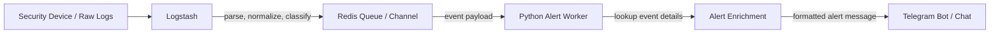
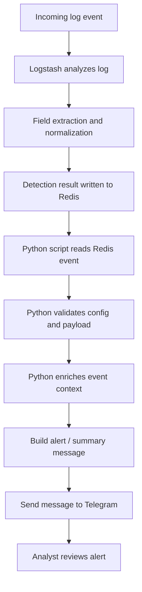
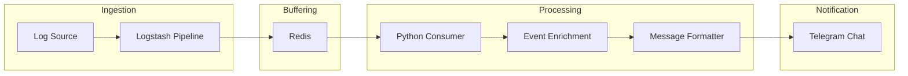

# MiniSOAR Program Flow

This document explains the current MiniSOAR runtime flow based on the project architecture:

`Logstash -> Redis -> Python Script -> Telegram`

## AI Session Code
- Claude : claude --resume e065865c-bc70-466c-80a6-4858df9e90e4
  
## High-Level Graph



## Runtime Flow



## Script Responsibility

### 1. Logstash
- Receives raw logs from the monitored source.
- Parses and normalizes fields.
- Detects or tags events that should become MiniSOAR alerts.
- Pushes the processed event into Redis for downstream handling.

### 2. Redis
- Acts as the handoff layer between ingestion and alerting.
- Stores the event temporarily so the Python worker can consume it.
- Decouples log analysis speed from Telegram delivery speed.

### 3. Python Script
- Reads alert events from Redis.
- Validates environment settings and event structure.
- Enriches the event with extra context when needed.
- Formats the final alert text for operational use.
- Sends the alert into Telegram.

### 4. Telegram
- Becomes the analyst-facing notification channel.
- Receives the formatted alert from the Python script.
- Allows operators to review the event quickly and continue response actions.

## Current Architecture View



## Refactored Package Architecture

MiniSOAR has now been refactored into a modular package structure under `minisoar/`:

- `minisoar/config.py` — centralized environment parsing, provider normalization, and Telegram config helpers.
- `minisoar/utils.py` — shared utility helpers for:
  - threat intelligence enrichment (`abuseipdb_lookup`, `ipapi_lookup`, `enrich_ip`, `enrich_multi_ip`)
  - whitelist/bypass checks
  - perimeter mapping lookup and telemetry log helpers
  - message formatting and Telegram delivery
- `minisoar/database.py` — Redis client, Elasticsearch indexing, event ID generation, and analyst label storage.
- `minisoar/mitigation/` — vendor-specific modules for Imperva, Palo Alto, and Akamai; `core.py` provides unified auto-block behavior.
- `minisoar/ml/` — ML inference, dataset export, and baseline training.
- `minisoar/daemon.py` — the Redis consumer loop, event enrichment, event indexing, ML recommendation, and alert broadcast logic.
- `minisoar/bot.py` — Telegram command handlers and callback handling for analyst-driven mitigation actions.

## Wrapper Entrypoints

The root-level executable scripts now act as thin wrappers only:

- `14_redis_telegram_alert.py` → calls `minisoar.daemon.main()`
- `09-tele-soar.py` → calls `minisoar.bot.main()`
- `export_dataset.py` → calls `minisoar.ml.export.main()`
- `train_baseline.py` → calls `minisoar.ml.train.main()`

This preserves the original operational entrypoints while keeping the core implementation inside the package.

## Legacy Cleanup

The following legacy transition files have been removed:
- `minisoar/legacy_alert_daemon.py`
- `minisoar/legacy_bot.py`
- `perimeter_mitigation.py`

Their responsibilities have been re-homed into the modular package files listed above.

## Testing

A pytest suite has been added under `tests/` with initial coverage for:
- config/provider normalization
- utility helpers
- ML inference fallback behavior
- mitigation mock flows
- event ID and timestamp parsing

Representative test files:
- `tests/test_config.py`
- `tests/test_utils.py`
- `tests/test_ml.py`
- `tests/test_mitigation.py`
- `tests/test_database.py`

### Mock Traffic Injection

To perform end-to-end operational testing without actual Logstash data, an analyst or developer can manually inject JSON payload directly into the Redis queue (`logstash_alert_queue`). This verifies the `minisoar.daemon` processing pipeline, ML scoring, and Telegram delivery.

Example execution (Windows PowerShell/Linux Terminal):
```bash
python -c "import redis, json, datetime; r = redis.StrictRedis(host='127.0.0.1', port=6379); payload = {'alert': {'type': 'alert_webshell_immediate', 'server_name': 'mock-target.com', 'src_ip': '8.8.8.8', 'method': 'POST', 'url': '/api/upload.php', 'status': '200', 'severity': 'high'}, 'tags': ['alert_webshell_immediate'], '@timestamp': datetime.datetime.now(datetime.timezone.utc).isoformat()}; r.lpush('logstash_alert_queue', json.dumps(payload)); print('Mock traffic berhasil dikirim ke Redis!')"
```

## Short Summary

MiniSOAR still works as an alert delivery and mitigation pipeline, but its implementation is now organized into a maintainable Python package. Logstash pushes alerts into Redis, `minisoar.daemon` consumes and enriches them, then broadcasts operational alerts to Telegram. Analysts interact through `minisoar.bot`, which issues mitigation actions through the vendor modules inside `minisoar/mitigation/`.

## Decision Log

### 2026-06-11 08:15 WIB
- **Problem:** `test_whitelist` in [test_utils.py](file:///c:/Users/rezy0/OneDrive%20-%20Kementerian%20Komunikasi%20dan%20Informatika/Documents/Kantor/Program/MiniSOAR/tests/test_utils.py) failed because `is_ip_whitelisted` expected 2 arguments (`ip` and `nets`), but was only called with 1 argument.
- **Solution:** Modified [test_utils.py](file:///c:/Users/rezy0/OneDrive%20-%20Kementerian%20Komunikasi%20dan%20Informatika/Documents/Kantor/Program/MiniSOAR/tests/test_utils.py) to supply a list of networks to the `is_ip_whitelisted` call in the test assertion.
- **Rationale:** The `is_ip_whitelisted` signature requires a subnet list parameter to determine matches cleanly without global state dependencies.

### 2026-06-11 12:40 WIB
- **Problem:** Linux installation command fails due to `externally-managed-environment` (PEP 668) restriction on Debian/Ubuntu modern distributions.
- **Solution:** Updated [Readme.md](file:///c:/Users/bandar/OneDrive%20-%20Kementerian%20Komunikasi%20dan%20Informatika/Documents/Kantor/Program/MiniSOAR/Readme.md) to split the Installation section into Windows and Linux, detailing the creation/activation of `.venv` and providing `--break-system-packages` override context.
- **Rationale:** Clean environment setup prevents package pollution and guarantees correct path resolution across deployment targets.

### 2026-06-11 13:55 WIB
- **Problem:** Operational request to add initial IP whitelist entries for Komdigi internal and trusted systems.
- **Solution:** Created [minisoar-whitelist.txt](file:///c:/Users/bandar/OneDrive%20-%20Kementerian%20Komunikasi%20dan%20Informatika/Documents/Kantor/Program/MiniSOAR/minisoar-whitelist.txt) in the workspace root containing all requested IP addresses and CIDR subnets.
- **Rationale:** Separating IP whitelist into a dedicated text file prevents configuration clutter in `.env` and allows easy, plain-text additions.

### 2026-06-12 14:00 WIB
- **Problem:** Frequent immediate commits/activations on Palo Alto and Akamai under AUTO/SEMI mode can overload firewall CPUs and exceed edge network API limits.
- **Solution:** Extracted commit logic into a standalone `trigger_commit` method and added a `commit=False` parameter option to `trigger_auto_block`. Modifed the daemon loop in [daemon.py](file:///c:/Users/rezy0/OneDrive%20-%20Kementerian%20Komunikasi%20dan%20Informatika/Documents/Kantor/Program/MiniSOAR/minisoar/daemon.py) to queue pending commits and execute them in batches at configurable intervals (defined by `MINISOAR_COMMIT_INTERVAL`, defaulting to 1 hour).
- **Rationale:** Rate-limiting WAF/firewall config applications to batch schedules prevents API rate-limiting and CPU exhaust on the firewalls while maintaining fast IP additions to candidate configurations.

### 2026-06-12 14:20 WIB
- **Problem:** Logstash configuration files (`minisoar-perimeter.yml` and `minisoar-whitelist.yml`) clutter the repository root, confusing developers and complicating production deployment to `/etc/logstash/`.
- **Solution:** Relocated both `minisoar-perimeter.yml` and `minisoar-whitelist.yml` into the `logstash/` directory of the repository. Added `minisoar-whitelist.yml` to the git staging area, updated the `Readme.md` structure tree and config table, and verified path resolutions in the Python daemon.
- **Rationale:** Grouping all files deployed to `/etc/logstash/` on the server under the `logstash/` folder in the repository makes the project directory structure cleaner and ensures direct, correct deployment configurations.

### 2026-06-12 14:30 WIB
- **Problem:** Permanent blocking of attacker IPs on security perimeters can lead to blocklist bloat, security rule limit exhaustion, and accidental blocks of dynamic/shared user IPs (false positives).
- **Solution:** Implemented temporary blocking with dynamic extensions. Initial blocks last for 10 minutes (configurable via `MINISOAR_BLOCK_DURATION`, default 600s). If an active block receives subsequent attack events, the daemon extends the block duration by another 10 minutes from the time of the latest attack. Expiry timestamps are tracked using a Redis Sorted Set (`minisoar:pending_unblocks`). The daemon periodically checks for expired entries, issues atomic unblocks, and notifies the analyst channel.
- **Rationale:** Restricting perimeter blocks to a transient state reduces rule clutter and automates cleanup, while the sliding extension window ensures active threats remain blocked as long as the attack continues.

### 2026-06-12 14:45 WIB
- **Problem:** Running wrapper scripts (like `scripts/export_dataset.py` or `scripts/train_baseline.py`) from inside the `/scripts/` directory fails to load the project `.env` and reads/writes the dataset CSV to the wrong directory because `Path.cwd()` was used for resolution.
- **Solution:** Updated `minisoar/config.py`, `minisoar/ml/export.py`, and `minisoar/ml/train.py` to resolve `.env`, `dataset.csv`, and `baseline_model.joblib` paths dynamically using `Path(__file__)` relative to the package files instead of `Path.cwd()`.
- **Rationale:** Location-independent path resolution ensures the package can be executed or imported from any working directory while maintaining access to the centralized configuration and dataset files in the project root.

### 2026-06-12 15:05 WIB
- **Problem:** When an alert is detected on a website that is unmapped/unknown in the perimeter configuration, auto-mitigation block rules would skip it entirely, leaving the origin server exposed to attacks.
- **Solution:** Configured a catch-all route inside the `AUTO` and `SEMI` mitigation blocks: if the perimeter is unmapped (`mapped` flag is False), and the AI makes a high-confidence block prediction, the daemon falls back to issuing a temporary block on Imperva only (`["imperva"]`).
- **Rationale:** Falling back to Imperva as a default global security barrier for unmapped systems ensures active threats are mitigated immediately while preventing rule injection on incorrect perimeter firewalls.

### 2026-06-12 15:40 WIB
- **Problem:** When an alert is blocked on Imperva only (e.g. for unmapped websites), the Telegram broadcast notification erroneously states "Commit pending", even though Imperva updates take effect immediately and do not require scheduled batch commits like Palo Alto and Akamai.
- **Solution:** Modified the daemon alert string builder to evaluate if any target perimeter in the block group requires a commit (`paloalto` or `akamai`). If not, it omits the "Commit pending" string and displays a direct "Temporary block" status.
- **Rationale:** Making the pending commit flag conditional prevents confusion for security analysts and accurately reflects the real-time blocking status of the perimeter devices.

### 2026-06-15 13:25 WIB
- **Problem:** Operational requirement to establish static code analysis (SonarQube) in GitLab CI/CD pipelines to ensure code maintainability, security, and cleanliness.
- **Solution:** Added a `.gitlab-ci.yml` pipeline configuration file defining the `sonarqube-check` job which runs the official `sonarsource/sonar-scanner-cli` image.
- **Rationale:** Centralizing security scanner integration within the GitLab CI pipeline provides automated quality gates on each repository push, preventing regression and identifying code quality issues early.

### 2026-06-15 14:50 WIB
- **Problem:** In `AUTO` and `SEMI` modes, whitelisted IPs were still blocked if the ML model predicted them as malicious with high confidence (e.g. 95% for 10.2.57.246).
- **Solution:** Added a check for `whitelisted` in both `AUTO` and `SEMI` code blocks in `minisoar/daemon.py` to bypass any auto-blocking logic and explicitly label the AI response as `ALLOW (Whitelisted)`.
- **Rationale:** The whitelist is a hard security guarantee that should override any AI predictions to prevent critical false positives on trusted internal and corporate IPs.

### 2026-06-15 15:25 WIB
- **Problem:** Need to configure specific GitLab Runner tags, build cache, Quality Gate wait, and branch restrictions for the SonarQube CI/CD pipeline.
- **Solution:** Updated `.gitlab-ci.yml` by adding `tags: - sonar-scanner`, caching rules for `.sonar/cache`, quality gate parameter `-Dsonar.qualitygate.wait=true`, and `only: - dev` rule.
- **Rationale:** Restricting pipeline executions to the `dev` branch prevents redundant runs, while build caching and specific runner tags optimize build execution time and runner utilization.

### 2026-06-18 14:45 WIB
- **Problem:** Codebase lacks automated security scans, formatting/linting checks, static typing analysis, and testing pipelines on GitLab CI, and there is no equivalent configuration for GitHub Actions.
- **Solution:** Added a modular pipeline setup containing `security` (Gitleaks, Bandit), `lint` (Ruff, Mypy), and draft `test` (Pytest) stages to `.gitlab-ci.yml`. Concurrently, created an equivalent GitHub Actions workflow configuration in `.github/workflows/ci.yml`. All jobs and workflows are configured to run with manual triggers only (`when: manual` in GitLab, and `workflow_dispatch` in GitHub Actions) per user instructions.
- **Rationale:** Separating scans into individual jobs provides parallelization, immediate and clear error reporting, and allows non-blocking verification for draft test suites. The manual triggering prevents runner resource wastage and aligns with development flow preferences.
