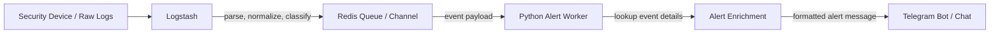
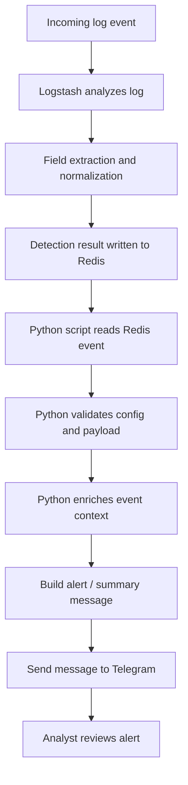
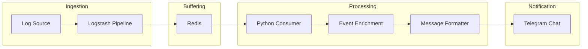

# MiniSOAR Program Flow

This document explains the current MiniSOAR runtime flow based on the project architecture:

`Logstash -> Redis -> Python Script -> Telegram`

## AI Session Code
- Claude : claude --resume e065865c-bc70-466c-80a6-4858df9e90e4
  
## High-Level Graph



## Runtime Flow



## Script Responsibility

### 1. Logstash
- Receives raw logs from the monitored source.
- Parses and normalizes fields.
- Detects or tags events that should become MiniSOAR alerts.
- Pushes the processed event into Redis for downstream handling.

### 2. Redis
- Acts as the handoff layer between ingestion and alerting.
- Stores the event temporarily so the Python worker can consume it.
- Decouples log analysis speed from Telegram delivery speed.

### 3. Python Script
- Reads alert events from Redis.
- Validates environment settings and event structure.
- Enriches the event with extra context when needed.
- Formats the final alert text for operational use.
- Sends the alert into Telegram.

### 4. Telegram
- Becomes the analyst-facing notification channel.
- Receives the formatted alert from the Python script.
- Allows operators to review the event quickly and continue response actions.

## Current Architecture View



## Refactored Package Architecture

MiniSOAR has now been refactored into a modular package structure under `minisoar/`:

- `minisoar/config.py` — centralized environment parsing, provider normalization, and Telegram config helpers.
- `minisoar/utils.py` — shared utility helpers for:
  - threat intelligence enrichment (`abuseipdb_lookup`, `ipapi_lookup`, `enrich_ip`, `enrich_multi_ip`)
  - whitelist/bypass checks
  - perimeter mapping lookup and telemetry log helpers
  - message formatting and Telegram delivery
- `minisoar/database.py` — Redis client, Elasticsearch indexing, event ID generation, and analyst label storage.
- `minisoar/mitigation/` — vendor-specific modules for Imperva, Palo Alto, and Akamai; `core.py` provides unified auto-block behavior.
- `minisoar/ml/` — ML inference, dataset export, and baseline training.
- `minisoar/daemon.py` — the Redis consumer loop, event enrichment, event indexing, ML recommendation, and alert broadcast logic.
- `minisoar/bot.py` — Telegram command handlers and callback handling for analyst-driven mitigation actions.

## Wrapper Entrypoints

The root-level executable scripts now act as thin wrappers only:

- `14_redis_telegram_alert.py` → calls `minisoar.daemon.main()`
- `09-tele-soar.py` → calls `minisoar.bot.main()`
- `export_dataset.py` → calls `minisoar.ml.export.main()`
- `train_baseline.py` → calls `minisoar.ml.train.main()`

This preserves the original operational entrypoints while keeping the core implementation inside the package.

## Legacy Cleanup

The following legacy transition files have been removed:
- `minisoar/legacy_alert_daemon.py`
- `minisoar/legacy_bot.py`
- `perimeter_mitigation.py`

Their responsibilities have been re-homed into the modular package files listed above.

## Testing

A pytest suite has been added under `tests/` with initial coverage for:
- config/provider normalization
- utility helpers
- ML inference fallback behavior
- mitigation mock flows
- event ID and timestamp parsing

Representative test files:
- `tests/test_config.py`
- `tests/test_utils.py`
- `tests/test_ml.py`
- `tests/test_mitigation.py`
- `tests/test_database.py`

### Mock Traffic Injection

To perform end-to-end operational testing without actual Logstash data, an analyst or developer can manually inject JSON payload directly into the Redis queue (`logstash_alert_queue`). This verifies the `minisoar.daemon` processing pipeline, ML scoring, and Telegram delivery.

Example execution (Windows PowerShell/Linux Terminal):
```bash
python -c "import redis, json, datetime; r = redis.StrictRedis(host='127.0.0.1', port=6379); payload = {'alert': {'type': 'alert_webshell_immediate', 'server_name': 'mock-target.com', 'src_ip': '8.8.8.8', 'method': 'POST', 'url': '/api/upload.php', 'status': '200', 'severity': 'high'}, 'tags': ['alert_webshell_immediate'], '@timestamp': datetime.datetime.now(datetime.timezone.utc).isoformat()}; r.lpush('logstash_alert_queue', json.dumps(payload)); print('Mock traffic berhasil dikirim ke Redis!')"
```

## Short Summary

MiniSOAR still works as an alert delivery and mitigation pipeline, but its implementation is now organized into a maintainable Python package. Logstash pushes alerts into Redis, `minisoar.daemon` consumes and enriches them, then broadcasts operational alerts to Telegram. Analysts interact through `minisoar.bot`, which issues mitigation actions through the vendor modules inside `minisoar/mitigation/`.
