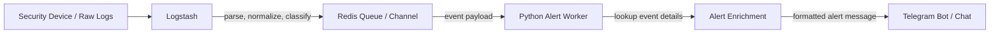
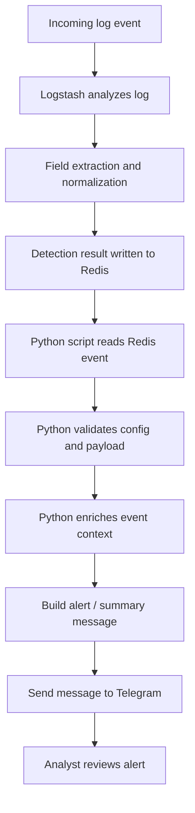
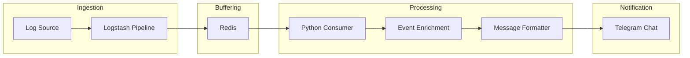

# MiniSOAR Program Flow

This document explains the current MiniSOAR runtime flow based on the project architecture:

`Logstash -> Redis -> Python Script -> Telegram`

## High-Level Graph

## Runtime Flow

## Script Responsibility

### 1. Logstash
- Receives raw logs from the monitored source.
- Parses and normalizes fields.
- Detects or tags events that should become MiniSOAR alerts.
- Pushes the processed event into Redis for downstream handling.

### 2. Redis
- Acts as the handoff layer between ingestion and alerting.
- Stores the event temporarily so the Python worker can consume it.
- Decouples log analysis speed from Telegram delivery speed.

### 3. Python Script
- Reads alert events from Redis.
- Validates environment settings and event structure.
- Enriches the event with extra context when needed.
- Formats the final alert text for operational use.
- Sends the alert into Telegram.

### 4. Telegram
- Becomes the analyst-facing notification channel.
- Receives the formatted alert from the Python script.
- Allows operators to review the event quickly and continue response actions.

## Current Architecture View

## Short Summary

MiniSOAR currently works as an alert delivery pipeline. Logstash analyzes incoming logs and pushes selected events into Redis. The Python layer consumes those Redis events, enriches and formats them, then sends the result to Telegram for analyst visibility.
