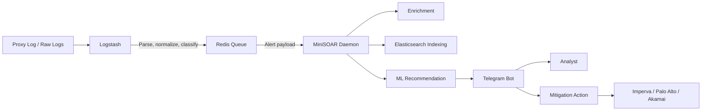

# MiniSOAR

MiniSOAR adalah orkestrator keamanan ringan berbasis **Logstash**, **Redis**, **Python**, dan **Telegram Bot**. Sistem ini dibuat untuk menerima alert keamanan, melakukan enrichment terhadap IP penyerang, memberi rekomendasi keputusan, dan membantu proses mitigasi ke perimeter seperti **Imperva**, **Palo Alto**, dan **Akamai**.

Dokumentasi ini menggabungkan penjelasan dari README, Context, dan Wiki lama agar seluruh informasi utama berada di satu tempat.

---

## Daftar Isi

- [Ringkasan Alur Kerja](#ringkasan-alur-kerja)
- [Fitur Utama](#fitur-utama)
- [Arsitektur Sistem](#arsitektur-sistem)
- [Struktur Project](#struktur-project)
- [Persyaratan](#persyaratan)
- [Instalasi](#instalasi)
- [Konfigurasi Environment](#konfigurasi-environment)
- [Mode Operasi Blocking](#mode-operasi-blocking)
- [Menjalankan Layanan](#menjalankan-layanan)
- [Perintah Telegram Bot](#perintah-telegram-bot)
- [Testing dan Mock Traffic](#testing-dan-mock-traffic)
- [Machine Learning](#machine-learning)
- [Catatan Operasional dan Keamanan](#catatan-operasional-dan-keamanan)

---

## Ringkasan Alur Kerja

MiniSOAR bekerja dengan alur berikut:

```text
Security Device / Raw Logs
        ↓
Logstash Detection Pipeline
        ↓
Redis Queue
        ↓
Python Alert Daemon
        ↓
Enrichment, Event Indexing, ML Recommendation
        ↓
Telegram Notification / Analyst Action
        ↓
Mitigation ke Imperva, Palo Alto, atau Akamai
```

Secara sederhana:

1. **Logstash** membaca log dari sumber keamanan, melakukan normalisasi field, lalu mendeteksi pola serangan atau anomali.
2. Alert yang valid dikirim ke **Redis** sebagai buffer queue.
3. **MiniSOAR daemon** membaca event dari Redis.
4. Daemon melakukan enrichment, whitelist/bypass check, event indexing, dan scoring berbasis rule/ML.
5. Alert dikirim ke **Telegram** agar analis dapat melihat konteks dan mengambil tindakan.
6. Jika mode mengizinkan, MiniSOAR dapat menjalankan blokir otomatis atau semi-otomatis ke perimeter.

---

## Fitur Utama

- **Telegram-based SOAR workflow** untuk notifikasi dan aksi analis.
- **Redis queue** sebagai buffer agar proses deteksi dan notifikasi tidak saling blocking.
- **Threat intelligence enrichment** menggunakan AbuseIPDB dan IP API.
- **Whitelist dan bypass list** untuk mencegah false positive terhadap IP internal atau trusted.
- **Perimeter mapping** untuk menentukan vendor mitigasi berdasarkan domain/website.
- **Integrasi mitigation** ke Imperva, Palo Alto, dan Akamai.
- **Mode MANUAL, SEMI, dan AUTO** untuk fleksibilitas tingkat otomasi.
- **Mock mode** agar testing tidak memanggil API perimeter sungguhan.
- **Event indexing ke Elasticsearch** untuk audit, label analis, dan kebutuhan ML.
- **Machine learning baseline** untuk memberi rekomendasi block/allow berdasarkan data historis.
- **Cross-platform path handling** agar dapat berjalan di Linux/WSL maupun Windows development host.

---

## Arsitektur Sistem



### Tanggung jawab komponen

| Komponen | Tanggung Jawab |
|---|---|
| Logstash | Membaca log, normalisasi field, deteksi alert, dan push event ke Redis. |
| Redis | Menjadi buffer queue antara pipeline deteksi dan worker Python. |
| MiniSOAR Daemon | Membaca event, enrichment, indexing, ML scoring, dan broadcast alert. |
| Telegram Bot | Menampilkan alert, menerima command analis, dan menjalankan callback action. |
| Mitigation Modules | Menjalankan block/unblock ke Imperva, Palo Alto, atau Akamai. |
| Elasticsearch | Menyimpan event, label analis, dan data untuk retraining ML. |

---

## Struktur Project

Implementasi utama sudah dipisahkan ke package `minisoar/` agar lebih mudah dirawat.

```text
minisoar/
├── bot.py                  # Telegram command handler dan callback action
├── config.py               # Parsing env, normalisasi provider, helper Telegram
├── daemon.py               # Redis consumer, enrichment, indexing, ML, alert broadcast
├── database.py             # Redis client, Elasticsearch indexing, event ID, label storage
├── utils.py                # Helper enrichment, whitelist, bypass, formatting, Telegram send
├── mitigation/             # Integrasi vendor perimeter
│   ├── akamai.py
│   ├── core.py             # Unified auto-block controller
│   ├── imperva.py
│   └── paloalto.py
└── ml/                     # Export dataset, training, dan inference model
```

Beberapa wrapper lama tetap dapat dipakai untuk menjaga kompatibilitas operasional:

| Wrapper Lama | Entry Point Baru |
|---|---|
| `14_redis_telegram_alert.py` | `minisoar.daemon.main()` |
| `09-tele-soar.py` | `minisoar.bot.main()` |
| `export_dataset.py` | `minisoar.ml.export.main()` |
| `train_baseline.py` | `minisoar.ml.train.main()` |

---

## Persyaratan

- Python 3.10+
- Redis Server
- Telegram Bot Token dan Chat ID
- Elasticsearch, opsional tetapi direkomendasikan untuk event storage dan ML retraining
- Akses API vendor perimeter jika ingin menjalankan mitigasi real:
  - Imperva
  - Palo Alto
  - Akamai

---

## Instalasi

Clone repository, masuk ke folder project, lalu install dependensi:

```bash
pip install redis requests xmltodict python-telegram-bot edgegrid-python pyyaml pandas scikit-learn joblib python-dotenv
```

Disarankan menggunakan virtual environment:

```bash
python -m venv .venv
source .venv/bin/activate  # Linux / WSL
# .venv\Scripts\activate   # Windows PowerShell
pip install redis requests xmltodict python-telegram-bot edgegrid-python pyyaml pandas scikit-learn joblib python-dotenv
```

---

## Konfigurasi Environment

Buat file `.env` di root project. Gunakan `env.example` sebagai acuan.

```ini
# === Redis Queue ===
REDIS_HOST=127.0.0.1
REDIS_PORT=6379
REDIS_KEY=logstash_alert_queue

# === Telegram Bot ===
TELEGRAM_BOT=YOUR_TELEGRAM_BOT_TOKEN
TELEGRAM_CHAT_ID=YOUR_TELEGRAM_CHAT_ID
TELEGRAM_PROCESS_CHAT_ID=YOUR_PROCESS_CHAT_ID
ALLOWED_USERS=123456789,987654321

# === Threat Intelligence ===
ABUSEIPDB_API_KEY=YOUR_ABUSEIPDB_API_KEY
ABUSEIPDB_CACHE_TTL=21600
IPAPI_CACHE_TTL=43200
LOOKUP_TIMEOUT=4

# === Elasticsearch ===
ES_HOSTS=https://YOUR_ELASTICSEARCH_HOST:9200
ES_USER=YOUR_ES_USER
ES_PASS=YOUR_ES_PASS
ES_VERIFY=false
ES_EVENTS_INDEX_PREFIX=minisoar-events
ES_LABELS_INDEX_PREFIX=minisoar-labels
ES_TIMEOUT=6
MINISOAR_EVENT_WINDOW=60

# === Testing / Safety ===
MINISOAR_MOCK=1

# === Blocking Mode ===
MINISOAR_BLOCKING_MODE=MANUAL
```

### File konfigurasi pendukung

| File | Fungsi |
|---|---|
| `minisoar-perimeter.yml` | Mapping website/domain ke provider mitigasi. |
| `minisoar-whitelist.txt` | IP/CIDR trusted. Alert tetap dikirim, tetapi tombol block disembunyikan. |
| `minisoar-bypass.txt` | IP/CIDR yang diabaikan total. Alert tidak dikirim ke Telegram. |

---

## Mode Operasi Blocking

MiniSOAR mendukung tiga mode melalui `MINISOAR_BLOCKING_MODE`.

| Mode | Perilaku | Rekomendasi Penggunaan |
|---|---|---|
| `MANUAL` | Semua alert dikirim ke Telegram. Analis memilih action secara manual. | Paling aman untuk production awal. |
| `SEMI` | AI memberi rekomendasi. Jika confidence tinggi, sistem dapat melakukan auto-block. | Cocok setelah rule dan whitelist stabil. |
| `AUTO` | Prediksi berbahaya langsung diblokir ke perimeter. | Gunakan hanya jika model, whitelist, dan rollback sudah matang. |

> Untuk staging atau demo, aktifkan `MINISOAR_MOCK=1` agar API block/unblock tidak benar-benar dijalankan ke vendor perimeter.

---

## Menjalankan Layanan

Jalankan dua proses utama berikut di terminal terpisah.

### 1. Alert daemon

Daemon membaca queue Redis, melakukan enrichment, indexing, ML scoring, dan mengirim alert ke Telegram.

```bash
python -m minisoar.daemon
```

Atau melalui wrapper lama:

```bash
python 14_redis_telegram_alert.py
```

### 2. Telegram bot handler

Bot menerima command operator dan callback action dari Telegram.

```bash
python -m minisoar.bot
```

Atau melalui wrapper lama:

```bash
python 09-tele-soar.py
```

---

## Perintah Telegram Bot

| Perintah | Deskripsi | Platform |
|---|---|---|
| `/help` | Menampilkan bantuan dan ringkasan command. | Bot |
| `/blockonimperva <ip>` | Menambahkan IP ke blocklist Imperva. | Imperva |
| `/unblockonimperva <ip>` | Menghapus IP dari blocklist Imperva. | Imperva |
| `/blocklistimperva` | Menampilkan IP yang diblokir di Imperva. | Imperva |
| `/tracev <event_id>` | Melakukan tracing violation di Imperva. | Imperva |
| `/blockonpalo <ip>` | Menambahkan IP ke address group Palo Alto. | Palo Alto |
| `/unblockonpalo <ip>` | Menghapus IP dari address group Palo Alto. | Palo Alto |
| `/commitpalo` | Melakukan partial commit Palo Alto. | Palo Alto |
| `/blockonakamai <ip>` | Menambahkan IP ke Akamai Client List. | Akamai |
| `/unblockonakamai <ip>` | Menghapus IP dari Akamai Client List. | Akamai |
| `/blocklistakamai` | Menampilkan IP yang diblokir di Akamai. | Akamai |
| `/activateakamai` | Mengaktivasi konfigurasi Akamai ke STAGING dan PRODUCTION. | Akamai |
| `/activationstatus <id>` | Mengecek status aktivasi Akamai. | Akamai |

---

## Testing dan Mock Traffic

Untuk menguji alur end-to-end tanpa Logstash asli, inject payload langsung ke Redis.

Pastikan daemon dan bot sudah berjalan, lalu jalankan:

```bash
python -c "import redis, json, datetime; r = redis.StrictRedis(host='127.0.0.1', port=6379); payload = {'alert': {'type': 'alert_webshell_immediate', 'server_name': 'mock-target.com', 'src_ip': '8.8.8.8', 'method': 'POST', 'url': '/api/upload.php', 'status': '200', 'severity': 'high'}, 'tags': ['alert_webshell_immediate'], '@timestamp': datetime.datetime.now(datetime.timezone.utc).isoformat()}; r.lpush('logstash_alert_queue', json.dumps(payload)); print('Mock traffic berhasil dikirim ke Redis!')"
```

Jika tersedia, mock traffic yang lebih lengkap dapat dijalankan dengan:

```bash
python scratch/mock_traffic.py
```

---

## Machine Learning

MiniSOAR memiliki pipeline ML sederhana untuk membantu memberi rekomendasi block/allow berdasarkan event historis dan label analis.

### 1. Export dataset

```bash
python -m minisoar.ml.export
```

Atau melalui wrapper lama:

```bash
python export_dataset.py
```

Output utama: `dataset.csv`.

### 2. Training baseline model

```bash
python -m minisoar.ml.train
```

Atau melalui wrapper lama:

```bash
python train_baseline.py
```

Output utama: `baseline_model.joblib`.

### 3. Restart daemon

Model dibaca saat daemon start. Setelah training ulang, restart daemon agar model baru dipakai.

```bash
# Stop daemon dengan Ctrl+C, lalu jalankan ulang
python -m minisoar.daemon
```

---

## Catatan Operasional dan Keamanan

- Jangan commit file `.env` atau credential vendor ke repository.
- Gunakan `MINISOAR_MOCK=1` saat development, demo, atau staging.
- Mulai dari `MINISOAR_BLOCKING_MODE=MANUAL` sebelum mengaktifkan `SEMI` atau `AUTO`.
- Pastikan `ALLOWED_USERS` hanya berisi Telegram user ID operator yang berwenang.
- Review whitelist dan bypass list secara berkala.
- Gunakan TLS verification untuk Elasticsearch di production. Hindari `ES_VERIFY=false` kecuali untuk lab/testing.
- Simpan audit log action agar aktivitas block/unblock dapat ditelusuri.
- Untuk Logstash pipeline yang memakai filter `aggregate`, gunakan `pipeline.workers: 1` agar agregasi event tetap konsisten.

