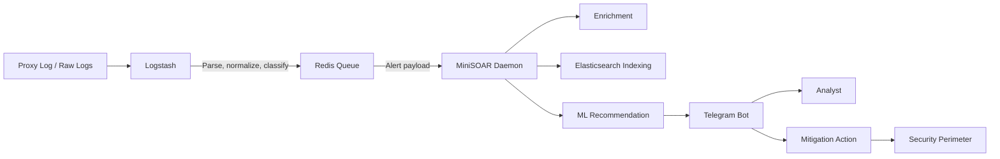

# MiniSOAR

MiniSOAR adalah orkestrator keamanan ringan berbasis **Logstash**, **Redis**, **Python**, dan **Telegram Bot**. Sistem ini dibuat untuk menerima alert keamanan, melakukan enrichment terhadap IP penyerang, memberi rekomendasi keputusan, dan membantu proses mitigasi ke perimeter seperti **Imperva**, **Palo Alto**, dan **Akamai**.

Dokumentasi ini menggabungkan penjelasan dari README, Context, dan Wiki lama agar seluruh informasi utama berada di satu tempat.

---

## Daftar Isi

- [Ringkasan Alur Kerja](#ringkasan-alur-kerja)
- [Fitur Utama](#fitur-utama)
- [Arsitektur Sistem](#arsitektur-sistem)
- [Struktur Project](#struktur-project)
- [Persyaratan](#persyaratan)
- [Instalasi](#instalasi)
- [Konfigurasi Environment](#konfigurasi-environment)
- [Mode Operasi Blocking](#mode-operasi-blocking)
- [Menjalankan Layanan](#menjalankan-layanan)
- [Perintah Telegram Bot](#perintah-telegram-bot)
- [Testing dan Mock Traffic](#testing-dan-mock-traffic)
- [Machine Learning](#machine-learning)
- [Catatan Operasional dan Keamanan](#catatan-operasional-dan-keamanan)

---

## Ringkasan Alur Kerja

MiniSOAR bekerja dengan alur berikut:

```text
Proxy Logs / Raw Logs
        ↓
Elasticsearch
        ↓
Logstash Detection Pipeline
        ↓
Redis Queue
        ↓
Python Alert Daemon
        ↓
Enrichment, Event Indexing, ML Recommendation
        ↓
Telegram Notification / Analyst Action
        ↓
Mitigation Action ke Security Perimeter
```

Secara sederhana:

1. **Logstash** membaca log dari elasticsearch, melakukan normalisasi field, lalu mendeteksi pola serangan atau anomali.
2. Alert yang valid dikirim ke **Redis** sebagai buffer queue.
3. **MiniSOAR daemon** membaca event dari Redis.
4. Daemon melakukan enrichment, whitelist/bypass check, event indexing, dan scoring berbasis rule/ML.
5. Alert dikirim ke **Telegram** agar analis dapat melihat konteks dan mengambil tindakan.
6. Jika mode mengizinkan, MiniSOAR dapat menjalankan blokir otomatis atau semi-otomatis ke perimeter.

---

## Fitur Utama

- **Telegram-based SOAR workflow** untuk notifikasi dan aksi analis.
- **Redis queue** sebagai buffer agar proses deteksi dan notifikasi tidak saling blocking.
- **Threat intelligence enrichment** menggunakan AbuseIPDB dan IP API.
- **Whitelist dan bypass list** untuk mencegah false positive terhadap IP internal atau trusted.
- **Perimeter mapping** untuk menentukan vendor mitigasi berdasarkan domain/website.
- **Integrasi mitigation** ke security perimeter dengan API. 
- **Mode MANUAL, SEMI, dan AUTO** untuk fleksibilitas tingkat otomasi.
- **Mock mode** agar testing tidak memanggil API perimeter sungguhan.
- **Event indexing ke Elasticsearch** untuk audit, label analis, dan kebutuhan ML.
- **Machine learning baseline** untuk memberi rekomendasi block/allow berdasarkan data historis.
- **Cross-platform path handling** agar dapat berjalan di Linux/WSL maupun Windows development host.

---

## Arsitektur Sistem



### Tanggung jawab komponen

| Komponen | Tanggung Jawab |
|---|---|
| Logstash | Membaca log, normalisasi field, deteksi alert, dan push event ke Redis. |
| Redis | Menjadi buffer queue antara pipeline deteksi dan worker Python. |
| MiniSOAR Daemon | Membaca event, enrichment, indexing, ML scoring, dan broadcast alert. |
| Telegram Bot | Menampilkan alert, menerima command analis, dan menjalankan callback action. |
| Mitigation Modules | Menjalankan block/unblock ke Security Perimeter. |
| Elasticsearch | Menyimpan event, label analis, dan data untuk retraining ML. |

---

## Struktur Project

Berikut adalah struktur organisasi direktori proyek:

```text
MiniSOAR/
├── logstash/                     # Konfigurasi pipeline deteksi Logstash
│   ├── 01-detection.conf         # Pipeline untuk normalisasi dan deteksi alert
│   ├── 02-alert-redis.conf       # Pipeline pengiriman alert ke Redis
│   ├── minisoar-perimeter.yml    # Pemetaan target domain ke provider mitigasi
│   └── minisoar-whitelist.yml    # Whitelist domain, keyword, dan anti-judi untuk Logstash
├── minisoar/                     # Kode utama aplikasi SOAR (modul Python)
│   ├── __init__.py
│   ├── bot.py                    # Handlers Telegram bot dan interaksi analis
│   ├── config.py                 # Konfigurasi environment dan variabel SOAR
│   ├── daemon.py                 # Core consumer loop dari Redis ke Telegram
│   ├── database.py               # Pustaka koneksi database (Redis & Elasticsearch)
│   ├── utils.py                  # Fungsi utilitas (Enrichment, IP validation, dll.)
│   ├── mitigation/               # Integrasi mitigasi WAF dan perimeter keamanan
│   │   ├── __init__.py
│   │   ├── akamai.py             # Integrasi Fast Purge / Client List Akamai
│   │   ├── core.py               # Orchestrator block/unblock dan commit
│   │   ├── imperva.py            # Integrasi API blocking IP Imperva
│   │   └── paloalto.py           # Integrasi Address Object/Group Palo Alto
│   └── ml/                       # Modul klasifikasi machine learning (Phase 1 & 2)
│       ├── __init__.py
│       ├── export.py             # Pustaka export dataset dari Elasticsearch/Redis
│       ├── inference.py          # Logika prediksi decision block
│       └── train.py              # Pustaka training model klasifikasi baseline
├── scratch/                      # Skrip uji coba lokal dan mock data
│   ├── mock_traffic.py           # Injeksi data simulasi ke Redis
│   ├── test_imports.py           # Verifikasi import modul Python
│   └── test_predict.py           # Verifikasi fungsi prediksi ML secara lokal
├── scripts/                      # Script wrapper penunjang operasional
│   ├── export_dataset.py         # Wrapper pengekspor dataset ML
│   └── train_baseline.py         # Wrapper pen-training model baseline ML
├── tests/                        # Unit test suite (Pytest)
│   ├── __init__.py
│   ├── test_config.py            # Test case untuk parsing config
│   ├── test_database.py          # Test case koneksi & operasi DB
│   ├── test_mitigation.py        # Test case fungsi mitigasi (mock)
│   ├── test_ml.py                # Test case inference fallback
│   └── test_utils.py             # Test case helper utilities
├── .gitignore
├── .gitlab-ci.yml                 # Konfigurasi GitLab CI/CD (SonarQube analysis)
├── Changelog.md                  # Catatan riwayat rilis proyek
├── Readme.md                     # Dokumentasi utama proyek SOAR
├── WIKI.md                       # Dokumentasi tambahan teknis operasional
├── env.example                   # Contoh konfigurasi environment variable
└── requirements.txt              # Daftar dependensi pustaka Python
```

Beberapa wrapper lama tetap dapat dipakai untuk menjaga kompatibilitas operasional:

| Wrapper Lama | Entry Point Baru |
|---|---|
| `14_redis_telegram_alert.py` | `minisoar.daemon.main()` |
| `09-tele-soar.py` | `minisoar.bot.main()` |
| `scripts/export_dataset.py` | `minisoar.ml.export.main()` |
| `scripts/train_baseline.py` | `minisoar.ml.train.main()` |

---

## Persyaratan

- Python 3.10+
- Redis Server
- Telegram Bot Token dan Chat ID
- Elasticsearch, opsional tetapi direkomendasikan untuk event storage dan ML retraining
- Security perimeter yang memiliki fitur konfigurasi dengan API

---

## Instalasi

### 1. Windows

Buka PowerShell atau Command Prompt, masuk ke folder project, lalu buat dan aktifkan virtual environment:

```powershell
python -m venv .venv
.venv\Scripts\activate
pip install -r requirements.txt
```

### 2. Linux (Ubuntu/Debian modern)

Pada Linux modern (Python 3.11+ / PEP 668), Anda akan menemui error `externally-managed-environment` jika menginstal paket Python secara global. Anda **wajib** menggunakan virtual environment untuk mengisolasi dependensi proyek:

```bash
# Update dan instal dependensi venv sistem jika belum ada
sudo apt update && sudo apt install -y python3-venv python3-full

# Buat virtual environment
python3 -m venv .venv

# Aktifkan virtual environment
source .venv/bin/activate

# Install dependensi proyek
pip install -r requirements.txt
```

> [!NOTE]
> Jika Anda menjalankan aplikasi ini di dalam container terisolasi (seperti Docker) dan ingin mengabaikan pembatasan sistem secara global, Anda dapat menggunakan flag `--break-system-packages`:
> ```bash
> pip install -r requirements.txt --break-system-packages
> ```

### 3. Logstash (Infrastruktur Deteksi)

MiniSOAR menggunakan **Logstash** untuk mendeteksi ancaman dari log keamanan dan mengalirkan peringatan ke Redis. Logstash dikonfigurasi menggunakan sistem **Pipeline-to-Pipeline Communication** dengan membagi proses menjadi dua tahap:

*   **Detection Pipeline ([01-detection.conf]):** Menarik log dari Elasticsearch secara periodik, melakukan normalisasi field, dan melakukan korelasi serta agregasi ancaman menggunakan filter `aggregate`.
*   **Alert Pipeline ([02-alert-redis.conf]):** Menerima luaran dari detection pipeline melalui modul internal Logstash, menetapkan tingkat keparahan (*severity*), memformat teks notifikasi, dan mengirimkannya ke antrean Redis `logstash_alert_queue`.

#### A. Instalasi Logstash (Debian/Ubuntu)

Jalankan perintah berikut untuk menginstal repositori resmi Elastic dan menginstal Logstash:

```bash
# 1. Install Java OpenJDK (prasyarat Logstash)
sudo apt install -y openjdk-17-jre-headless

# 2. Tambahkan Elastic GPG Key dan Repositori
wget -qO - https://artifacts.elastic.co/GPG-KEY-elasticsearch | sudo gpg --dearmor -o /usr/share/keyrings/elasticsearch-keyring.gpg
echo "deb [signed-by=/usr/share/keyrings/elasticsearch-keyring.gpg] https://artifacts.elastic.co/packages/8.x/apt stable main" | sudo tee /etc/apt/sources.list.d/elastic-8.x.list

# 3. Instal Logstash
sudo apt update && sudo apt install -y logstash
```

#### B. Konfigurasi Multi-Pipeline Logstash

Salin file konfigurasi [01-detection.conf] dan [02-alert-redis.conf] ke server Anda (misalnya diletakkan di `/home/ubuntu/Mini-SOAR-dev/`).

Edit berkas `/etc/logstash/pipelines.yml` untuk memetakan kedua pipeline tersebut:

```yaml
# /etc/logstash/pipelines.yml

- pipeline.id: detection-pipeline
  path.config: "/home/ubuntu/Mini-SOAR-dev/01-detection.conf"
  # CRITICAL: Wajib bernilai 1 agar filter 'aggregate' berjalan konsisten pada satu utas (thread).
  pipeline.workers: 1

- pipeline.id: alert-pipeline
  path.config: "/home/ubuntu/Mini-SOAR-dev/02-alert-redis.conf"
```

#### C. Menjalankan Layanan Logstash

```bash
# Aktifkan dan jalankan Logstash sebagai systemd service
sudo systemctl daemon-reload
sudo systemctl enable logstash
sudo systemctl start logstash

# Pantau logs Logstash untuk verifikasi kesalahan
sudo tail -f /var/log/logstash/logstash-plain.log
```

#### D. Menjalankan MiniSOAR sebagai Systemd Service

Agar daemon alert consumer dan Telegram bot berjalan secara persisten di latar belakang (background) dan otomatis menyala kembali setelah crash atau server restart, buat service systemd berikut:

##### 1. Service untuk Alert Daemon (`minisoar-daemon.service`)
Buat file unit systemd baru:
```bash
sudo nano /etc/systemd/system/minisoar-daemon.service
```
Tempelkan konfigurasi berikut (sesuaikan `User` dan `WorkingDirectory` dengan environment Anda):
```ini
[Unit]
Description=MiniSOAR Alert Daemon Service
After=network.target redis-server.service

[Service]
Type=simple
User=ubuntu
WorkingDirectory=/home/ubuntu/Mini-SOAR
ExecStart=/home/ubuntu/Mini-SOAR/.venv/bin/python -m minisoar.daemon
Restart=on-failure
RestartSec=5s
Environment=PYTHONUNBUFFERED=1

[Install]
WantedBy=multi-user.target
```

##### 2. Service untuk Telegram Bot (`minisoar-bot.service`)
Buat file unit systemd baru:
```bash
sudo nano /etc/systemd/system/minisoar-bot.service
```
Tempelkan konfigurasi berikut:
```ini
[Unit]
Description=MiniSOAR Telegram Bot Service
After=network.target

[Service]
Type=simple
User=ubuntu
WorkingDirectory=/home/ubuntu/Mini-SOAR
ExecStart=/home/ubuntu/Mini-SOAR/.venv/bin/python -m minisoar.bot
Restart=on-failure
RestartSec=5s
Environment=PYTHONUNBUFFERED=1

[Install]
WantedBy=multi-user.target
```

##### 3. Mengaktifkan dan Mengelola Layanan
Jalankan perintah berikut untuk memuat ulang systemd, lalu mengaktifkan dan menjalankan kedua service:
```bash
# Reload systemd configuration
sudo systemctl daemon-reload

# Enable auto-start pada saat booting
sudo systemctl enable minisoar-daemon
sudo systemctl enable minisoar-bot

# Jalankan service secara instan
sudo systemctl start minisoar-daemon
sudo systemctl start minisoar-bot

# Periksa status masing-masing service
sudo systemctl status minisoar-daemon
sudo systemctl status minisoar-bot
```

Untuk memantau log aktivitas (stdout/stderr) dari service, gunakan perintah:
```bash
# Pantau log Alert Daemon
journalctl -u minisoar-daemon -f

# Pantau log Telegram Bot
journalctl -u minisoar-bot -f
```

---

## Konfigurasi Environment

Buat file `.env` di root project. Gunakan `env.example` sebagai acuan.

```ini
# === Redis Queue ===
REDIS_HOST=127.0.0.1
REDIS_PORT=6379
REDIS_KEY=logstash_alert_queue

# === Telegram Bot ===
TELEGRAM_BOT=YOUR_TELEGRAM_BOT_TOKEN
TELEGRAM_CHAT_ID=YOUR_TELEGRAM_CHAT_ID
TELEGRAM_PROCESS_CHAT_ID=YOUR_PROCESS_CHAT_ID
ALLOWED_USERS=123456789,987654321

# === Threat Intelligence ===
ABUSEIPDB_API_KEY=YOUR_ABUSEIPDB_API_KEY
ABUSEIPDB_CACHE_TTL=21600
IPAPI_CACHE_TTL=43200
LOOKUP_TIMEOUT=4

# === Elasticsearch ===
ES_HOSTS=https://YOUR_ELASTICSEARCH_HOST:9200
ES_USER=YOUR_ES_USER
ES_PASS=YOUR_ES_PASS
ES_VERIFY=false
ES_EVENTS_INDEX_PREFIX=minisoar-events
ES_LABELS_INDEX_PREFIX=minisoar-labels
ES_TIMEOUT=6
MINISOAR_EVENT_WINDOW=60

# === Security Perimeter Credentials ===
# Imperva
IMPERVA_BASE_URL=https://YOUR_IMPERVA_BASE_URL
IMPERVA_USERNAME=YOUR_IMPERVA_USERNAME
IMPERVA_PASSWORD=YOUR_IMPERVA_PASSWORD
IMPERVA_GROUP_NAME=Blocked-IP-Addresses

# Palo Alto
PA_HOST=https://YOUR_PA_HOST
PA_API_KEY=YOUR_PA_API_KEY
PA_VSYS=vsys1
PA_GROUP=YOUR_PA_GROUP
PA_ADMIN=YOUR_PA_ADMIN

# Akamai
AKAMAI_BASEURL=https://YOUR_AKAMAI_BASEURL
AKAMAI_LIST_ID=YOUR_AKAMAI_LIST_ID
AKAMAI_CLIENT_TOKEN=YOUR_AKAMAI_CLIENT_TOKEN
AKAMAI_CLIENT_SECRET=YOUR_AKAMAI_CLIENT_SECRET
AKAMAI_ACCESS_TOKEN=YOUR_AKAMAI_ACCESS_TOKEN
AKAMAI_ACCOUNT_SWITCH=

# === Testing / Safety ===
MINISOAR_MOCK=1

# === Blocking Mode ===
MINISOAR_BLOCKING_MODE=MANUAL
```,StartLine:191,TargetContent:

### File konfigurasi pendukung

| File | Fungsi |
|---|---|
| `logstash/minisoar-perimeter.yml` | Mapping website/domain ke provider mitigasi. |
| `logstash/minisoar-whitelist.yml` | Whitelist website, keyword, dan anti-judi untuk pendeteksian Logstash. |
| `minisoar-whitelist.txt` | IP/CIDR trusted. Alert tetap dikirim, tetapi tombol block disembunyikan. |
| `minisoar-bypass.txt` | IP/CIDR yang diabaikan total. Alert tidak dikirim ke Telegram. |

---

## Mode Operasi Blocking

MiniSOAR mendukung tiga mode melalui `MINISOAR_BLOCKING_MODE`.

| Mode | Perilaku | Rekomendasi Penggunaan |
|---|---|---|
| `MANUAL` | Semua alert dikirim ke Telegram. Analis memilih action secara manual. | Paling aman untuk production awal. |
| `SEMI` | AI memberi rekomendasi. Jika confidence tinggi, sistem dapat melakukan auto-block. | Cocok setelah rule dan whitelist stabil. |
| `AUTO` | Prediksi berbahaya langsung diblokir ke perimeter. | Gunakan hanya jika model, whitelist, dan rollback sudah matang. |

> Untuk staging atau demo, aktifkan `MINISOAR_MOCK=1` agar API block/unblock tidak benar-benar dijalankan ke vendor perimeter.

---

## Menjalankan Layanan

Jalankan dua proses utama berikut di terminal terpisah.

### 1. Alert daemon

Daemon membaca queue Redis, melakukan enrichment, indexing, ML scoring, dan mengirim alert ke Telegram.

```bash
python -m minisoar.daemon
```

Atau melalui wrapper lama:

```bash
python 14_redis_telegram_alert.py
```

### 2. Telegram bot handler

Bot menerima command operator dan callback action dari Telegram.

```bash
python -m minisoar.bot
```

Atau melalui wrapper lama:

```bash
python 09-tele-soar.py
```

---

## Perintah Telegram Bot (Studi Kasus Imperva, Palo Alto, dan Akamai)

| Perintah | Deskripsi | Platform |
|---|---|---|
| `/help` | Menampilkan bantuan dan ringkasan command. | Bot |
| `/blockonimperva <ip>` | Menambahkan IP ke blocklist Imperva. | Imperva |
| `/unblockonimperva <ip>` | Menghapus IP dari blocklist Imperva. | Imperva |
| `/blocklistimperva` | Menampilkan IP yang diblokir di Imperva. | Imperva |
| `/tracev <event_id>` | Melakukan tracing violation di Imperva. | Imperva |
| `/blockonpalo <ip>` | Menambahkan IP ke address group Palo Alto. | Palo Alto |
| `/unblockonpalo <ip>` | Menghapus IP dari address group Palo Alto. | Palo Alto |
| `/commitpalo` | Melakukan partial commit Palo Alto. | Palo Alto |
| `/blockonakamai <ip>` | Menambahkan IP ke Akamai Client List. | Akamai |
| `/unblockonakamai <ip>` | Menghapus IP dari Akamai Client List. | Akamai |
| `/blocklistakamai` | Menampilkan IP yang diblokir di Akamai. | Akamai |
| `/activateakamai` | Mengaktivasi konfigurasi Akamai ke STAGING dan PRODUCTION. | Akamai |
| `/activationstatus <id>` | Mengecek status aktivasi Akamai. | Akamai |

---

## Testing dan Mock Traffic

Untuk menguji alur end-to-end tanpa Logstash asli, inject payload langsung ke Redis.

Pastikan daemon dan bot sudah berjalan, lalu jalankan:

```bash
python -c "import redis, json, datetime; r = redis.StrictRedis(host='127.0.0.1', port=6379); payload = {'alert': {'type': 'alert_webshell_immediate', 'server_name': 'mock-target.com', 'src_ip': '8.8.8.8', 'method': 'POST', 'url': '/api/upload.php', 'status': '200', 'severity': 'high'}, 'tags': ['alert_webshell_immediate'], '@timestamp': datetime.datetime.now(datetime.timezone.utc).isoformat()}; r.lpush('logstash_alert_queue', json.dumps(payload)); print('Mock traffic berhasil dikirim ke Redis!')"
```

Jika tersedia, mock traffic yang lebih lengkap dapat dijalankan dengan:

```bash
python scratch/mock_traffic.py
```

---

## Machine Learning

MiniSOAR memiliki pipeline ML sederhana untuk membantu memberi rekomendasi block/allow berdasarkan event historis dan label analis.

### 1. Export dataset

```bash
python -m minisoar.ml.export
```

Atau melalui wrapper lama:

```bash
python scripts/export_dataset.py
```

Output utama: `dataset.csv`.

### 2. Training baseline model

```bash
python -m minisoar.ml.train
```

Atau melalui wrapper lama:

```bash
python scripts/train_baseline.py
```

Output utama: `baseline_model.joblib`.

### 3. Restart daemon

Model dibaca saat daemon start. Setelah training ulang, restart daemon agar model baru dipakai.

```bash
# Stop daemon dengan Ctrl+C, lalu jalankan ulang
python -m minisoar.daemon
```

---

## Catatan Operasional dan Keamanan

- Jangan commit file `.env` atau credential vendor ke repository.
- Gunakan `MINISOAR_MOCK=1` saat development, demo, atau staging.
- Mulai dari `MINISOAR_BLOCKING_MODE=MANUAL` sebelum mengaktifkan `SEMI` atau `AUTO`.
- Pastikan `ALLOWED_USERS` hanya berisi Telegram user ID operator yang berwenang.
- Review whitelist dan bypass list secara berkala.
- Gunakan TLS verification untuk Elasticsearch di production. Hindari `ES_VERIFY=false` kecuali untuk lab/testing.
- Simpan audit log action agar aktivitas block/unblock dapat ditelusuri.
- Untuk Logstash pipeline yang memakai filter `aggregate`, gunakan `pipeline.workers: 1` agar agregasi event tetap konsisten.

