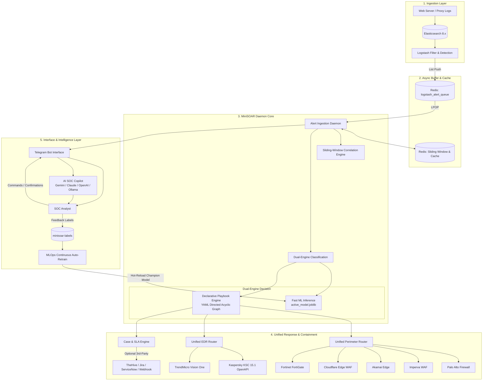

# MiniSOAR Architecture & Design

## 1. Diagram Arsitektur Sistem

MiniSOAR mengadopsi pola arsitektur **Event-Driven & Micro-Engine Architecture** yang memisahkan ingestion, buffer queue, correlation, decision, dan execution layers.

---

## 2. Rincian Komponen Inti

### A. Sliding-Window Correlation Engine (`minisoar/correlation.py`)
- **Tujuan:** Mencegah alert fatigue dan mendeteksi pola serangan terdistribusi.
- **Mekanisme:**
  - **Hit Aggregation:** Menggunakan Redis `ZADD` dan `ZREMRANGEBYSCORE` dengan timestamp epoch unix.
  - **Anti-Storm Throttling:** Mencegah pengiriman lebih dari 1 notifikasi per interval jendela waktu per IP/alert type.
  - **Campaign Detection:** Menghitung jumlah IP penyerang unik yang menargetkan server atau pola URL yang sama.

### B. Declarative Playbook Engine (`minisoar/playbook/`)
- **Tujuan:** Mengotomatiskan SOP mitigasi tanpa mengubah kode sumber Python.
- **Fitur Utama:**
  - Definisi workflow berbasis YAML di `minisoar/playbooks/`.
  - **Safe AST Evaluator:** Mengevaluasi kondisi rule (`alert.severity == 'high' and reputation_score >= 80`) menggunakan `ast.parse` tanpa fungsi `eval()` berbahaya.
  - **Extensible Action Registry:** Mendukung aksi perimeter (`mitigation.block_ip`), EDR (`edr.isolate_endpoint`, `edr.add_ioc`), ticketing (`case.create_case`), dan AI Copilot (`ai.copilot_analyze`).

### C. Unified Perimeter & EDR Routers
- **Perimeter Router (`minisoar/mitigation/core.py`):** Mengabstraksi panggilan API ke 5 provider perimeter (Palo Alto, Imperva, Akamai, Cloudflare, FortiGate) dengan fallback parsing IP, normalisasi status, dan rollback unblock.
- **EDR Router (`minisoar/edr/core.py`):** Mengabstraksi isolasi host internal dan distribusi IoC ke Kaspersky KSC (OpenAPI Session, HostGroup) dan TrendMicro (Cloud One & Vision One).

### D. Dual-Engine AI SOC Copilot & MLOps
- **Fast-Path Traffic Classification:** Inferensi sub-milidetik menggunakan model scikit-learn (`active_model.joblib`) berbasis ekstraksi fitur TF-IDF + metadata keamanan.
- **GenAI Copilot:** Asisten analis interaktif berbasis SDK (Google Antigravity/Gemini, Anthropic Claude, OpenAI Codex, Ollama) untuk deobfuskasi skrip kompleks, RCA, dan MITRE ATT&CK mapping.
- **MLOps Auto-Retraining (`minisoar/ml/autotrain.py`):** Membaca dataset umpan balik dari analis (`minisoar-labels`), melatih model Challenger, memverifikasi ambang batas kualitas (ROC-AUC $\ge 0.85$), dan me-reload model secara hot-reload tanpa downtime.
