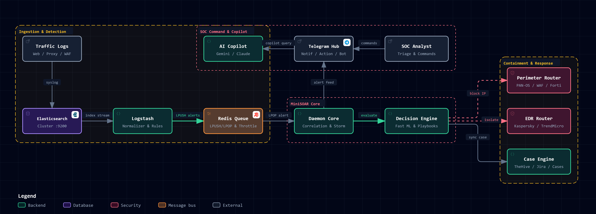
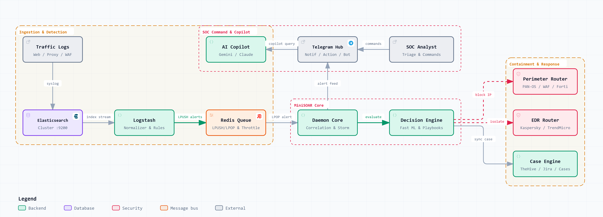
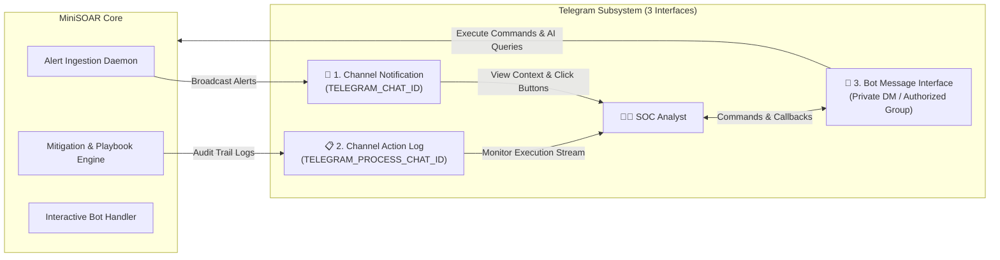
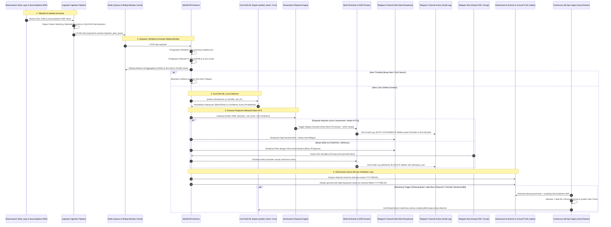
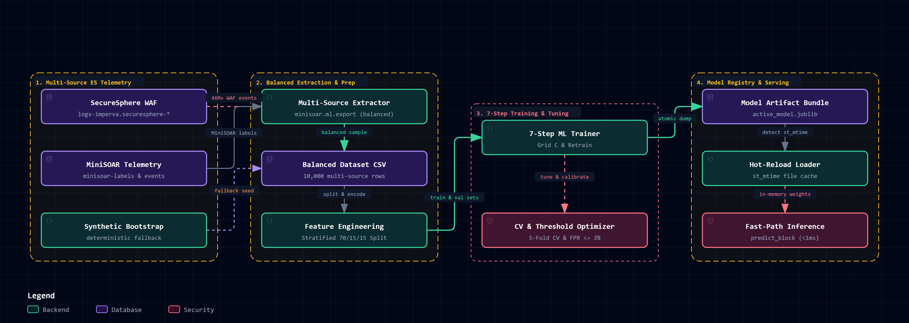
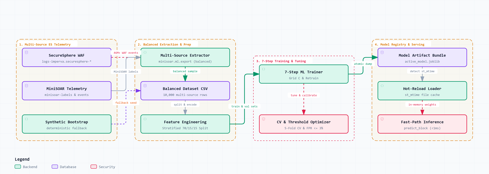
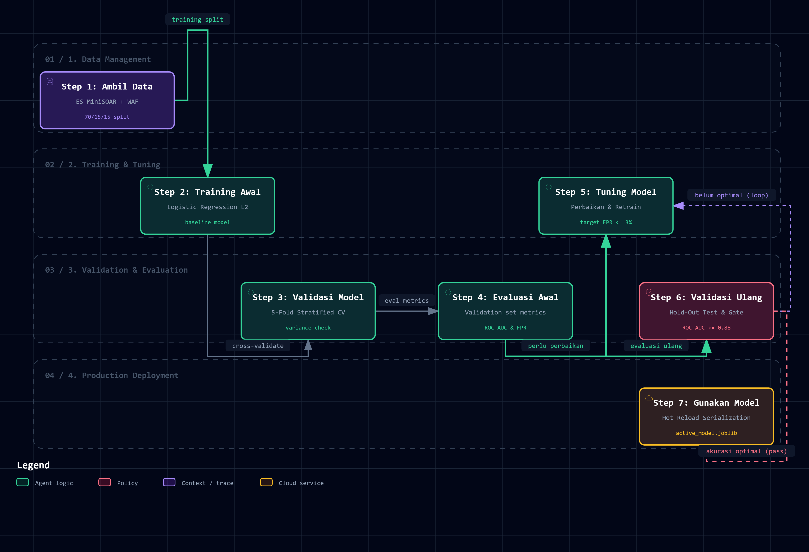

# MiniSOAR Architecture & System Design

## 1. Diagram Arsitektur Sistem Terpadu (Archify & Interactive Viewer)

MiniSOAR mengadopsi pola arsitektur **Event-Driven & Micro-Engine Architecture** yang memisahkan lapisan *Ingestion*, *Buffer & State Caching*, *Correlation & Decision*, *Response & Containment*, serta *Triple-Interface Telegram & AI Intelligence Layer*.

> [!TIP]
> **Diagram Arsitektur Interaktif (Archify v2.16)**
> - 🌐 **Buka Aplikasi Viewer Interaktif:** [`docs/assets/minisoar-architecture.html`](./assets/minisoar-architecture.html)
> - 📄 **Spesifikasi JSON-IR Archify:** [`docs/assets/minisoar-architecture.architecture.json`](./assets/minisoar-architecture.architecture.json)
> - ✨ **Fitur:** Dukungan Dark / Light theme, Pan & Zoom tak terbatas, 3 Guided Focus Views (*Threat-to-Mitigation*, *SOC Collaboration*, *Response Orchestration*), relationship tracing otomatis, dan ekspor instan (SVG / PNG / WebP / WebM).

<b>🔍 Klik untuk melihat Diagram dalam Light Theme</b>

---

## 2. Arsitektur 3-Interface Telegram (Triple-Interface Telegram Subsystem)

MiniSOAR mengimplementasikan pemisahan antarmuka Telegram menjadi **3 kanal independen** untuk membedakan aliran informasi deteksi, audit operasional, dan interaksi perintah analis:

### A. Interface 1: Channel Notification (`TELEGRAM_CHAT_ID`)
- **Tujuan:** Kanal siaran khusus (*alert broadcast feed*) untuk seluruh tim SOC.
- **Fungsi & Karakteristik:**
  - Menerima pesan alert keamanan terstruktur dari Daemon saat event anomali terdeteksi.
  - Menampilkan ringkasan ancaman: Tipe Serangan, Emoji Severity, Target Host, Path URL, IP Penyerang, dan Skor Reputasi IP (AbuseIPDB/ip-api).
  - Dilengkapi **Inline Action Buttons** (`[Block IP]`, `[Ignore]`, `[Details]`) jika sistem berada pada `MINISOAR_BLOCKING_MODE=SEMI`.

### B. Interface 2: Channel Action & Audit Log (`TELEGRAM_PROCESS_CHAT_ID`)
- **Tujuan:** Kanal audit stream khusus (*operational transparency & audit trail*) untuk memantau setiap aksi yang dieksekusi sistem atau analis.
- **Fungsi & Karakteristik:**
  - Dipisahkan dari Channel Notif agar percakapan alert tidak tertimbun log eksekusi.
  - Setiap tindakan mitigasi (`[BLOCKED] IP on Palo Alto / Cloudflare`, `[UNBLOCKED] IP`, `[ISOLATED] Host on Kaspersky KSC`, `[CASE CREATED] Case #102`, `[TICKET SYNC] Jira SEC-401`) otomatis dikirimkan ke kanal ini melalui fungsi `notify_action_log()`.
  - Berisi identitas eksekutor (nama analis, user ID Telegram, atau `Playbook Engine`), timestamp eksekusi, provider tujuan, dan alasan tindakan.

### C. Interface 3: Interactive Bot Message Interface (`minisoar/bot.py`)
- **Tujuan:** Antarmuka interaksi langsung dua arah (*conversational command center*) antara analis SOC dan engine MiniSOAR via pesan pribadi (DM) atau grup terotorisasi.
- **Fungsi & Karakteristik:**
  - **Role-Based Access Control (RBAC):** Memvalidasi setiap pengirim perintah terhadap daftar `ALLOWED_USER_IDS` di `.env`. Perintah dari unauthorized user akan langsung ditolak dan dicatat.
  - **Interactive Callback Handlers:** Memproses klik tombol inline keyboard dari Channel Notif.
  - **Pusat Eksekusi Perintah Komprehensif:**
    - *Perimeter:* `/block`, `/unblock`, `/blockoncf`, `/blockonforti`, `/commit`, `/status`.
    - *EDR Endpoint:* `/isolatehost`, `/restorehost`, `/queryhost`, `/addedrioc`, `/edrstatus`.
    - *Case & SLA:* `/cases`, `/case`, `/updatecase`, `/syncticket`, `/socmetrics`, `/exportcase`.
    - *GenAI Copilot:* `/askai <pertanyaan>`, `/rca <ip_or_id>`, `/retrainmodel`.

---

## 3. Aliran Siklus Hidup Event (End-to-End Event Lifecycle)

Aliran siklus hidup pemrosesan event di MiniSOAR dirancang untuk merespons ancaman secara *real-time* dengan mengintegrasikan deteksi stream, inferensi Machine Learning lokal, evaluasi Playbook deklaratif, serta loop umpan-balik MLOps berkelanjutan:

> [!TIP]
> **Diagram Alur Sekuensial Siklus Hidup Event (High-Resolution Zoomable)**
> - 🔍 **Buka Berkas Vektor SVG (Zoom Tak Terbatas):** [`docs/assets/minisoar-event-lifecycle-sequence.svg`](./assets/minisoar-event-lifecycle-sequence.svg)
> - 🖼️ **Buka Berkas Raster PNG Resolusi Tinggi (4.6 MB):** [`docs/assets/minisoar-event-lifecycle-sequence.png`](./assets/minisoar-event-lifecycle-sequence.png)

<b>🔍 Klik untuk melihat Source Code Mermaid Sequence Diagram</b>

### Tahapan Kunci dalam Siklus Hidup Event:

1. **Ingestion & Normalisasi Log:**
   - Mengonsumsi log lalu lintas HTTP/Proxy dan telemetri WAF Imperva SecureSphere (`logs-imperva.securesphere-*`). Logstash memproses regex deteksi, deobfuskasi awal, dan melakukan `LPUSH` payload ke Redis.
2. **Korelasi Cerdas & Anti-Storm:**
   - Daemon mengambil payload dari Redis, mencocokkan terhadap whitelist aset internal, dan memeriksa frekuensi anomali pada jendela geser (*sliding-window*) Redis. Jika terjadi banjir ribuan request dari IP yang sama, sistem meredam notifikasi duplikat guna melindungi analis dari *alert fatigue*.
3. **Inferensi Machine Learning Sub-Milidetik:**
   - Sebelum playbook mengambil keputusan, daemon menjalankan fungsi `predict_block()` secara *in-memory* ($< 1\text{ ms}$). Model mengevaluasi probabilitas serangan berdasarkan reputasi IP, frekuensi hit, tipe detektor, dan *calibrated decision threshold* yang membatasi False Positive ($\text{FPR} \le 3\%$).
4. **Orkestrasi Respons & Triple-Interface Telegram:**
   - Hasil evaluasi playbook menentukan apakah respon dieksekusi seketika (**Mode AUTO**) atau menunggu persetujuan analis via tombol interaktif Telegram (**Mode SEMI**). Seluruh tindakan mitigasi dicatat ke kanal audit khusus (`TELEGRAM_PROCESS_CHAT_ID`).
5. **Continuous Ground-Truth Feedback Loop (MLOps):**
   - Setiap keputusan analis (apakah menekan `[Block IP]` atau `[Ignore]`) otomatis tersimpan di indeks `minisoar-labels-*`. Data ini secara berkala memicu pelatihan ulang model (*continuous learning*) untuk memperbarui akurasi model terhadap variasi ancaman baru.

---

## 4. Rincian Komponen & Sub-Engine

### A. Sliding-Window Correlation & Anti-Storm Engine (`minisoar/correlation.py`)
- **Tujuan:** Mencegah *alert fatigue* dan mendeteksi serangan multi-vektor / terdistribusi.
- **Mekanisme Teknis:**
  - **Hit Aggregation:** Menggunakan Redis `ZADD` (skor = epoch unix) dan `ZREMRANGEBYSCORE` untuk menghitung frekuensi hit serangan dalam rentang waktu geser (`MINISOAR_EVENT_WINDOW`, default 60s).
  - **Anti-Storm Throttling:** Mencegah pengiriman alert duplikat untuk kombinasi `<src_ip>:<alert_type>` yang sama dalam jendela waktu throttling (`throttle:<ip>:<type>`).
  - **Distributed Campaign Detection:** Melacak himpunan IP unik per target asset (`campaign:<server_name>`). Jika jumlah penyerang unik melebihi ambang batas, sistem menaikkan severity menjadi `[DISTRIBUTED CAMPAIGN]`.

---

### B. Declarative Playbook Engine (`minisoar/playbook/`)
- **Tujuan:** Mengotomatiskan alur kerja respons insiden (SOP) secara fleksibel tanpa mengubah kode sumber.
- **Fitur Utama:**
  - **Definisi YAML:** Disimpan di direktori `minisoar/playbooks/` dengan deklarasi `trigger`, `conditions`, dan langkah `steps` terurut.
  - **Safe AST Condition Evaluator (`conditions.py`):** Mengevaluasi ekspresi boolean kompleks (contoh: `alert.severity == 'high' and reputation_score >= 80 and not is_whitelisted`) menggunakan pohon sintaks abstrak (`ast.parse`) yang aman dari eksekusi kode berbahaya.
  - **Action Registry (`actions.py`):** Mendukung aksi mitigasi perimeter (`mitigation.block_ip`, `mitigation.cloudflare_block`, `mitigation.fortigate_block`), aksi EDR (`edr.isolate_endpoint`, `edr.add_ioc`), manajemen kasus (`case.create_case`, `case.update_case`), notifikasi Telegram, dan AI Copilot (`ai.copilot_analyze`).

---

### C. Unified Perimeter & EDR Routers
- **Perimeter Router (`minisoar/mitigation/core.py`):**
  Mengabstraksi operasi blokir dan unblokir ke 5 provider perimeter:
  - **Palo Alto Networks:** Address object dan dynamic address group (DAG) manipulation via PAN-OS XML API.
  - **Imperva WAF:** Site IP ACL and security rule modification via SecureSphere REST API.
  - **Akamai Kona Site Defender:** Network List update and staging/production activation via EdgeGrid API.
  - **Cloudflare Edge WAF:** IP Access Rules API (Block/Challenge) pada level Zone atau Account.
  - **Fortinet FortiGate:** Firewall Address Objects dan Address Groups via FortiOS REST API.
- **EDR Router (`minisoar/edr/core.py`):**
  Mengabstraksi operasi penahanan host dan distribusi IoC:
  - **Kaspersky Security Center (KSC 15.1 OpenAPI):** Session token lifecycle, HostGroup network isolation, dan IoC repository insertion.
  - **TrendMicro Vision One & Cloud One:** Endpoint network suspension dan response task execution.

---

### D. Case Management & Optional 3rd-Party Ticketing (`minisoar/cases/`)
- **Incident Lifecycle:** Pelacakan status insiden (`NEW` $\rightarrow$ `INVESTIGATING` $\rightarrow$ `CONTAINED` $\rightarrow$ `RESOLVED` $\rightarrow$ `CLOSED` / `FALSE_POSITIVE`).
- **SLA & SOC Metrics:** Perhitungan otomatis Mean Time to Detect (MTTD) dan Mean Time to Respond (MTTR).
- **Executive Reporting:** Generator laporan investigasi otomatis dalam format Markdown dan Standalone HTML.
- **Konektor Pihak Ketiga (100% Opsional):**
  - **TheHive 4/5:** Sinkronisasi case dan IoC observable.
  - **Jira Service Management:** Pembuatan tiket insiden pada project key target.
  - **ServiceNow Table API:** Pembuatan incident record dengan mapping otomatis Urgency & Impact.
  - **Generic Webhooks:** Integrasi fleksibel ke Zendesk, Freshservice, Slack, atau Microsoft Teams.

---

### E. Dual-Engine AI SOC Copilot & Continuous MLOps (`minisoar/ai/` & `minisoar/ml/`)
- **Fast-Path Traffic Processing:** Model machine learning lokal (`active_model.joblib`) berbasis scikit-learn untuk klasifikasi inferensi sub-milidetik pada lalu lintas data Redis real-time.
- **GenAI Copilot:** Asisten analis interaktif multi-provider (Google Antigravity/Gemini, Anthropic Claude, OpenAI Codex, Local Ollama) dengan dukungan berkas autentikasi terisolasi (`AI_AUTH_FILE`, `GEMINI_AUTH_FILE`, `CLAUDE_AUTH_FILE`).
- **Continuous Auto-Retraining (MLOps):** Pipeline otomatis yang mengekstrak label ground-truth analis dari `minisoar-labels-*`, melatih model Challenger, memvalidasi ambang batas kualitas (ROC-AUC $\ge 0.85$), dan me-reload model aktif secara hot-reload tanpa restart daemon.

---

### F. Alur & Metode Generasi Machine Learning Baseline & MLOps (`minisoar/ml/`)

Model machine learning baseline (`baseline_model.joblib`) dan challenger aktif (`active_model.joblib`) berfungsi sebagai engine inferensi lokal berkecepatan tinggi (*sub-millisecond local inference*) pada Core Daemon untuk memprediksi klasifikasi biner mitigasi (`label: 0` = Allow/Ignore, `label: 1` = Block IP).

#### 1. Diagram Arsitektur & Pipeline Baseline ML (Archify Interactive)

> [!TIP]
> **Diagram Alur Machine Learning Interaktif (Archify v2.16)**
> - 🌐 **Buka Aplikasi Viewer Interaktif:** [`docs/assets/minisoar-ml-pipeline.html`](./assets/minisoar-ml-pipeline.html)
> - 📄 **Spesifikasi JSON-IR Archify:** [`docs/assets/minisoar-ml-pipeline.architecture.json`](./assets/minisoar-ml-pipeline.architecture.json)
> - ✨ **Fitur:** Tampilan Dark/Light theme, Pan & Zoom tak terbatas, Guided Focus Views, tracing relasi otomatis, serta ekspor format SVG / PNG / WebP / WebM.

<b>🔍 Klik untuk melihat Diagram ML dalam Light Theme</b>

---

#### 2. Multi-Source Telemetry Ingestion di Elasticsearch (`minisoar/ml/export.py`)

MiniSOAR mengimplementasikan arsitektur penarikan data telemetri ganda (*Multi-Source Elasticsearch Ingestion*) yang menggabungkan:
1. **Internal MiniSOAR Indices (`minisoar-labels-*` & `minisoar-events-*`):**
   - Berisi histori keputusan analis SOC dan label automasi internal (~1.053 record).
   - Di-join menggunakan `event_id` secara batching (chunk size 1.000).
2. **Enterprise WAF Production Stream (`logs-imperva.securesphere-*`):**
   - Mengonsumsi log serangan cyber dunia nyata berskala puluhan juta event (>46.500.000 event).
   - Menerapkan **Stratified Balanced Sampling** (50% Block vs 50% None/Alert) dengan kuota default 10.000 sampel (`ES_SECURESPHERE_MAX_SAMPLES`) agar model tidak overfit terhadap label mayoritas.
   - Normalisasi jenis serangan WAF ke skema MiniSOAR:
     - `alert_sqli`: SQL Injection pada parameter URL/POST.
     - `alert_xss`: Cross-Site Scripting pada URL atau payload form.
     - `alert_webshell`: Remote Code Execution, PHP code injection, dan backdoor.
     - `alert_dir_traversal`: Path traversal dan directory enumeration.
     - `alert_web_profile`: Pelanggaran profil metode HTTP (`HEAD`, `POST`).
     - `alert_web_correlation`: Anomali korelasi multi-request WAF.
     - `alert_securesphere_waf`: Pelanggaran signature umum WAF & HTTP malformed headers.

---

#### 3. Penerapan 7-Step ML Lifecycle Workflow (`minisoar/ml/train.py`)

Proses pelatihan model baseline MiniSOAR mengadopsi alur kerja Machine Learning standar industri yang terbagi menjadi 7 tahapan sekuensial:

> [!TIP]
> **Diagram Alur 7-Step ML Lifecycle Interaktif (Archify v2.16)**
> - 🌐 **Buka Aplikasi Viewer Interaktif:** [`docs/assets/minisoar-ml-lifecycle.html`](./assets/minisoar-ml-lifecycle.html)
> - 📄 **Spesifikasi JSON-IR Archify:** [`docs/assets/minisoar-ml-lifecycle.workflow.json`](./assets/minisoar-ml-lifecycle.workflow.json)
> - ✨ **Fitur:** Dukungan Dark / Light theme, Pan & Zoom tak terbatas, 3 Guided Focus Views (*Complete 7-step lifecycle*, *Optimization & threshold calibration*, *Packaging & hot-reload*), tracing relasi otomatis, serta ekspor instan SVG / PNG / WebP / WebM.

<b>🔍 Klik untuk melihat Diagram ML Lifecycle dalam Light Theme</b>

1. **Step 1 — Mengambil Training Data (Data Ingestion & Preprocessing):**
   - Membaca `dataset.csv` hasil ekspor multi-source.
   - Normalisasi ordinal severity (`low: 0`, `medium: 1`, `high: 2`) dan One-Hot Encoding fitur kategorikal.
   - Partisi data secara terstratifikasi: **70% Training**, **15% Validation**, dan **15% Independent Hold-Out Test**.
2. **Step 2 — Mentraining Model Awal (Initial Training):**
   - Melatih model awal berbasis Logistic Regression dengan penalti L2 dan `class_weight="balanced"`.
3. **Step 3 — Validasi Model (Stratified K-Fold Cross-Validation):**
   - Menjalankan 5-Fold Stratified Cross-Validation pada data latih untuk mengukur stabilitas ROC-AUC dan F1-Score serta mendeteksi varians antar fold.
4. **Step 4 — Evaluasi Awal (Initial Evaluation):**
   - Evaluasi metrik awal pada validation set: ROC-AUC, Precision, Recall, F1-Score, Confusion Matrix, dan False Positive Rate (FPR).
5. **Step 5 — Perbaikan dan Training Ulang (Hyperparameter Tuning & Decision Threshold Optimization):**
   - **Grid Search:** Eksplorasi nilai regularisasi penalti $C \in [0.01, 0.1, 0.5, 1.0, 5.0, 10.0]$.
   - **Decision Threshold Optimization (`optimize_threshold()`):** Melakukan pemindaian ambang batas (threshold 0.10 hingga 0.90) untuk meminimalkan *False Positive Rate* ($\text{FPR} \le 3\%$) dengan F1-Score maksimal, mencegah salah blokir pada IP bisnis yang sah.
   - Melatih ulang model terbaik pada gabungan partisi Train + Validation.
6. **Step 6 — Validasi dan Evaluasi Ulang (Re-Validation & Re-Evaluation):**
   - Menguji model hasil perbaikan pada *Hold-Out Test Set* independen.
   - Memastikan pemenuhan **Quality Gate** ($\text{ROC-AUC} \ge 0.88$).
7. **Step 7 — Menggunakan Model (Deployment & Zero-Downtime Hot-Reload):**
   - Menyimpan artefak model lengkap ke `baseline_model.joblib` dan mempromosikannya ke `active_model.joblib`.
   - Engine inferensi (`minisoar/ml/inference.py`) otomatis mendeteksi perubahan `st_mtime` dan memuat ulang model secara *in-memory* tanpa menghentikan daemon.

---

### G. Cyber Attack Replay & Validation Harness (`minisoar/ml/replay.py`)

MiniSOAR dilengkapi modul simulasi dan validasi berbasis rekaman serangan cyber riil dari WAF Imperva SecureSphere.

#### 1. Arsitektur Replay & Adversarial Mimicking
- **Trafik Sumber:** Mengekstrak event serangan riil dari `logs-imperva.securesphere-*`.
- **Adversarial Payload Mimicking (`build_mimicked_soar_event()`):** Merekonstruksi alamat IP penyerang asli, domain target, path URI eksploitasi, nama rule/signature, dan skor reputasi ke dalam format event SOAR standar.
- **Evaluasi Kuantitatif:** Menguji seluruh payload serangan tiruan terhadap fungsi `predict_block()` dan menghasilkan laporan detection rate per kategori ancaman.
- **Live Injection ke Redis (`inject_attacks_to_redis()`):** Menyediakan opsi penyuntikan payload serangan tiruan langsung ke antrean Redis `logstash_alert_queue` untuk memverifikasi alur notifikasi bot Telegram dan tindakan playbook.

#### 2. Hasil Pembuktian Empiris (Empirical Evidence)
Pengujian validasi langsung terhadap **1.000 sampel serangan cyber riil** dari Elasticsearch menghasilkan:
- **Total Serangan Diuji:** 1.000 event
- **Total Serangan Terdeteksi:** 1.000 blokir (**Overall Detection Rate: 100.00%**)
- **Serangan Terlewat (False Negative):** 0
- **Rata-rata Confidence Probability Score:** **0.9974**

#### 3. Analisis Log `Action: None` (Penanganan Trafik Biasa)
Dari audit terhadap 1.000 sampel log SecureSphere berstatus `Action: None`:
- **Hasil Klasifikasi ML:** **100.0% dinilai ALLOW / IGNORE (0)** (False Positive Rate = 0.0%).
- **Web Profile / Policy Violations (Health Check HEAD, deviasi wajar):** Probabilitas blokir hanya **`0.0010` (0.1%)**, membuktikan model sangat aman terhadap kelangsungan trafik bisnis sah.
- **Signature Anomaly Non-blocking:** Rata-rata probabilitas blokir **`0.0884` (8.8%)**, tetap berada di bawah ambang batas blokir.

