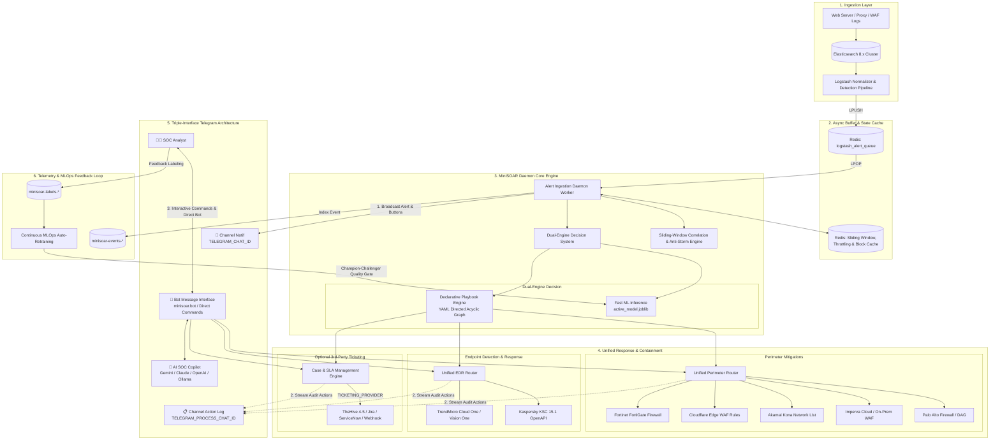
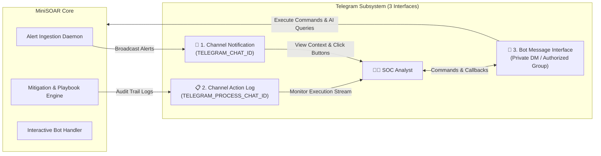
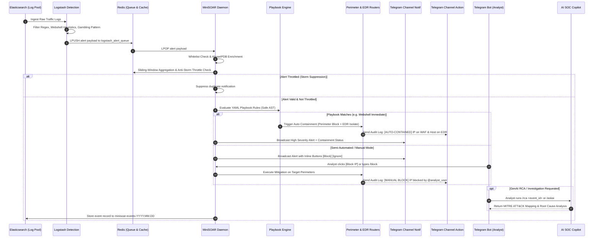

# MiniSOAR Architecture & System Design

## 1. Diagram Arsitektur Sistem Terpadu

MiniSOAR mengadopsi pola arsitektur **Event-Driven & Micro-Engine Architecture** yang memisahkan lapisan *Ingestion*, *Buffer & State Caching*, *Correlation & Decision*, *Response & Containment*, serta *Triple-Interface Telegram & AI Intelligence Layer*.

---

## 2. Arsitektur 3-Interface Telegram (Triple-Interface Telegram Subsystem)

MiniSOAR mengimplementasikan pemisahan antarmuka Telegram menjadi **3 kanal independen** untuk membedakan aliran informasi deteksi, audit operasional, dan interaksi perintah analis:

### A. Interface 1: Channel Notification (`TELEGRAM_CHAT_ID`)
- **Tujuan:** Kanal siaran khusus (*alert broadcast feed*) untuk seluruh tim SOC.
- **Fungsi & Karakteristik:**
  - Menerima pesan alert keamanan terstruktur dari Daemon saat event anomali terdeteksi.
  - Menampilkan ringkasan ancaman: Tipe Serangan, Emoji Severity, Target Host, Path URL, IP Penyerang, dan Skor Reputasi IP (AbuseIPDB/ip-api).
  - Dilengkapi **Inline Action Buttons** (`[Block IP]`, `[Ignore]`, `[Details]`) jika sistem berada pada `MINISOAR_BLOCKING_MODE=SEMI`.

### B. Interface 2: Channel Action & Audit Log (`TELEGRAM_PROCESS_CHAT_ID`)
- **Tujuan:** Kanal audit stream khusus (*operational transparency & audit trail*) untuk memantau setiap aksi yang dieksekusi sistem atau analis.
- **Fungsi & Karakteristik:**
  - Dipisahkan dari Channel Notif agar percakapan alert tidak tertimbun log eksekusi.
  - Setiap tindakan mitigasi (`[BLOCKED] IP on Palo Alto / Cloudflare`, `[UNBLOCKED] IP`, `[ISOLATED] Host on Kaspersky KSC`, `[CASE CREATED] Case #102`, `[TICKET SYNC] Jira SEC-401`) otomatis dikirimkan ke kanal ini melalui fungsi `notify_action_log()`.
  - Berisi identitas eksekutor (nama analis, user ID Telegram, atau `Playbook Engine`), timestamp eksekusi, provider tujuan, dan alasan tindakan.

### C. Interface 3: Interactive Bot Message Interface (`minisoar/bot.py`)
- **Tujuan:** Antarmuka interaksi langsung dua arah (*conversational command center*) antara analis SOC dan engine MiniSOAR via pesan pribadi (DM) atau grup terotorisasi.
- **Fungsi & Karakteristik:**
  - **Role-Based Access Control (RBAC):** Memvalidasi setiap pengirim perintah terhadap daftar `ALLOWED_USER_IDS` di `.env`. Perintah dari unauthorized user akan langsung ditolak dan dicatat.
  - **Interactive Callback Handlers:** Memproses klik tombol inline keyboard dari Channel Notif.
  - **Pusat Eksekusi Perintah Komprehensif:**
    - *Perimeter:* `/block`, `/unblock`, `/blockoncf`, `/blockonforti`, `/commit`, `/status`.
    - *EDR Endpoint:* `/isolatehost`, `/restorehost`, `/queryhost`, `/addedrioc`, `/edrstatus`.
    - *Case & SLA:* `/cases`, `/case`, `/updatecase`, `/syncticket`, `/socmetrics`, `/exportcase`.
    - *GenAI Copilot:* `/askai <pertanyaan>`, `/rca <ip_or_id>`, `/retrainmodel`.

---

## 3. Aliran Siklus Hidup Event (End-to-End Event Lifecycle)

---

## 4. Rincian Komponen & Sub-Engine

### A. Sliding-Window Correlation & Anti-Storm Engine (`minisoar/correlation.py`)
- **Tujuan:** Mencegah *alert fatigue* dan mendeteksi serangan multi-vektor / terdistribusi.
- **Mekanisme Teknis:**
  - **Hit Aggregation:** Menggunakan Redis `ZADD` (skor = epoch unix) dan `ZREMRANGEBYSCORE` untuk menghitung frekuensi hit serangan dalam rentang waktu geser (`MINISOAR_EVENT_WINDOW`, default 60s).
  - **Anti-Storm Throttling:** Mencegah pengiriman alert duplikat untuk kombinasi `<src_ip>:<alert_type>` yang sama dalam jendela waktu throttling (`throttle:<ip>:<type>`).
  - **Distributed Campaign Detection:** Melacak himpunan IP unik per target asset (`campaign:<server_name>`). Jika jumlah penyerang unik melebihi ambang batas, sistem menaikkan severity menjadi `[DISTRIBUTED CAMPAIGN]`.

---

### B. Declarative Playbook Engine (`minisoar/playbook/`)
- **Tujuan:** Mengotomatiskan alur kerja respons insiden (SOP) secara fleksibel tanpa mengubah kode sumber.
- **Fitur Utama:**
  - **Definisi YAML:** Disimpan di direktori `minisoar/playbooks/` dengan deklarasi `trigger`, `conditions`, dan langkah `steps` terurut.
  - **Safe AST Condition Evaluator (`conditions.py`):** Mengevaluasi ekspresi boolean kompleks (contoh: `alert.severity == 'high' and reputation_score >= 80 and not is_whitelisted`) menggunakan pohon sintaks abstrak (`ast.parse`) yang aman dari eksekusi kode berbahaya.
  - **Action Registry (`actions.py`):** Mendukung aksi mitigasi perimeter (`mitigation.block_ip`, `mitigation.cloudflare_block`, `mitigation.fortigate_block`), aksi EDR (`edr.isolate_endpoint`, `edr.add_ioc`), manajemen kasus (`case.create_case`, `case.update_case`), notifikasi Telegram, dan AI Copilot (`ai.copilot_analyze`).

---

### C. Unified Perimeter & EDR Routers
- **Perimeter Router (`minisoar/mitigation/core.py`):**
  Mengabstraksi operasi blokir dan unblokir ke 5 provider perimeter:
  - **Palo Alto Networks:** Address object dan dynamic address group (DAG) manipulation via PAN-OS XML API.
  - **Imperva WAF:** Site IP ACL and security rule modification via SecureSphere REST API.
  - **Akamai Kona Site Defender:** Network List update and staging/production activation via EdgeGrid API.
  - **Cloudflare Edge WAF:** IP Access Rules API (Block/Challenge) pada level Zone atau Account.
  - **Fortinet FortiGate:** Firewall Address Objects dan Address Groups via FortiOS REST API.
- **EDR Router (`minisoar/edr/core.py`):**
  Mengabstraksi operasi penahanan host dan distribusi IoC:
  - **Kaspersky Security Center (KSC 15.1 OpenAPI):** Session token lifecycle, HostGroup network isolation, dan IoC repository insertion.
  - **TrendMicro Vision One & Cloud One:** Endpoint network suspension dan response task execution.

---

### D. Case Management & Optional 3rd-Party Ticketing (`minisoar/cases/`)
- **Incident Lifecycle:** Pelacakan status insiden (`NEW` $\rightarrow$ `INVESTIGATING` $\rightarrow$ `CONTAINED` $\rightarrow$ `RESOLVED` $\rightarrow$ `CLOSED` / `FALSE_POSITIVE`).
- **SLA & SOC Metrics:** Perhitungan otomatis Mean Time to Detect (MTTD) dan Mean Time to Respond (MTTR).
- **Executive Reporting:** Generator laporan investigasi otomatis dalam format Markdown dan Standalone HTML.
- **Konektor Pihak Ketiga (100% Opsional):**
  - **TheHive 4/5:** Sinkronisasi case dan IoC observable.
  - **Jira Service Management:** Pembuatan tiket insiden pada project key target.
  - **ServiceNow Table API:** Pembuatan incident record dengan mapping otomatis Urgency & Impact.
  - **Generic Webhooks:** Integrasi fleksibel ke Zendesk, Freshservice, Slack, atau Microsoft Teams.

---

### E. Dual-Engine AI SOC Copilot & Continuous MLOps (`minisoar/ai/` & `minisoar/ml/`)
- **Fast-Path Traffic Processing:** Model machine learning lokal (`active_model.joblib`) berbasis scikit-learn untuk klasifikasi inferensi sub-milidetik pada lalu lintas data Redis real-time.
- **GenAI Copilot:** Asisten analis interaktif multi-provider (Google Antigravity/Gemini, Anthropic Claude, OpenAI Codex, Local Ollama) dengan dukungan berkas autentikasi terisolasi (`AI_AUTH_FILE`, `GEMINI_AUTH_FILE`, `CLAUDE_AUTH_FILE`).
- **Continuous Auto-Retraining (MLOps):** Pipeline otomatis yang mengekstrak label ground-truth analis dari `minisoar-labels-*`, melatih model Challenger, memvalidasi ambang batas kualitas (ROC-AUC $\ge 0.85$), dan me-reload model aktif secara hot-reload tanpa restart daemon.
