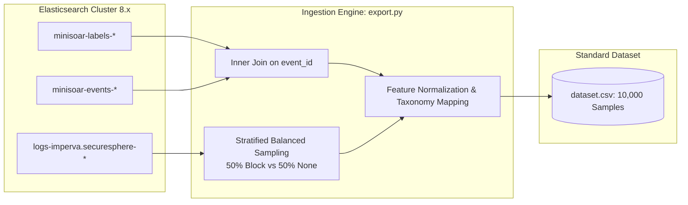
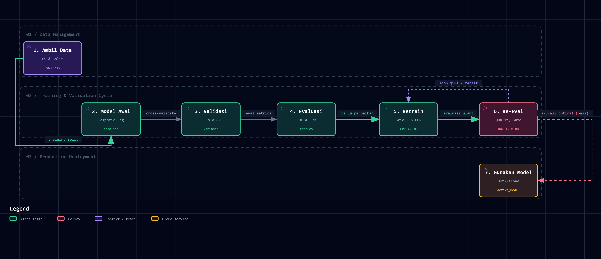
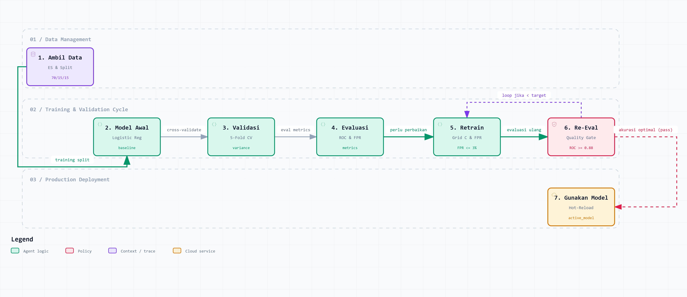

# MiniSOAR Machine Learning & MLOps Architecture Guide

Dokumen ini menjelaskan secara menyeluruh arsitektur, siklus hidup (*lifecycle*), metodologi pelatihan, dan prosedur operasional subsistem **Machine Learning (ML)** dan **Machine Learning Operations (MLOps)** pada platform **MiniSOAR**.

---

## 1. Peran & Prinsip Desain ML di MiniSOAR

Dalam ekosistem Security Orchestration, Automation, and Response (SOAR), model Machine Learning tidak berdiri sendiri, melainkan bertindak sebagai **Fast-Path Decision Engine** yang beroperasi secara *sub-milidetik* berdampingan dengan rule deterministik Logstash dan Declarative YAML Playbooks.

### Prinsip Utama:
1. **Zero-Latency Overhead ($< 1\text{ ms}$):**
   - Inferensi dilakukan secara lokal dalam memori proses daemon Python (`minisoar/ml/inference.py`), menghindari dependensi jaringan atau REST latency ke eksternal GPU server.
2. **Conservative & Defensive Against False Positives (FPR $\le 3\%$):**
   - Di lingkungan SOC komersial/pemerintahan, salah memblokir (*False Positive*) IP pelanggan atau layanan publik yang sah dapat berakibat fatal pada ketersediaan sistem.
   - Oleh karena itu, MiniSOAR menerapkan **Threshold Optimization** yang secara ketat membatasi False Positive Rate maksimal 3%.
3. **Continuous Ground-Truth Learning:**
   - Model dilatih bukan sekadar dari data buatan (*synthetic*), melainkan secara langsung dari dua sumber telemetri produksi: keputusan analis SOC di MiniSOAR dan data stream WAF enterprise **Imperva SecureSphere**.
4. **Zero-Downtime Hot-Reloading:**
   - Setiap pembaruan atau promosi model Challenger baru di-reload secara otomatis ke dalam memori daemon tanpa perlu me-restart proses atau memutuskan aliran antrean Redis.

---

## 2. Multi-Source Telemetry Ingestion (`minisoar/ml/export.py`)

MiniSOAR mengonsumsi data latih dari kluster Elasticsearch melalui modul `export_dataset_from_es()` yang menggabungkan dua sumber:



### A. Sumber 1: Indeks Internal MiniSOAR
- **Indeks:** `minisoar-labels-*` dan `minisoar-events-*`.
- **Karakteristik:** Berisi ~1.053 sampel keputusan manual analis SOC (klik tombol Telegram `[Block IP]` atau `[Ignore]`) dan eksekusi otomatis playbook.
- **Join Strategy:** Pengambilan batching berukuran 1.000 `event_id` menggunakan query `terms`.

### B. Sumber 2: Data Stream WAF Imperva SecureSphere
- **Indeks/Data Stream:** `logs-imperva.securesphere-*` (>46.500.000 log riil).
- **Distribusi Alami di Elasticsearch:**
  - `Action: Block` (~37,7 juta / 81,1%): Serangan berbahaya yang diblokir WAF.
  - `Action: None` (~8,7 juta / 18,9%): Serangan alert-only dan deviasi profil wajar (metode `HEAD`, `POST` form publik).
- **Stratified Balanced Sampling:**
  - Mengambil kuota seimbang (default 5.000 sampel `Block` dan 5.000 sampel `None`) agar model tidak bias terhadap kelas mayoritas.
- **Normalisasi Taksonomi Detektor (`normalize_securesphere_detector`):**
  - SQL Injection $\rightarrow$ `alert_sqli`
  - Cross-Site Scripting $\rightarrow$ `alert_xss`
  - PHP Code Injection & Webshell $\rightarrow$ `alert_webshell`
  - Directory Traversal $\rightarrow$ `alert_dir_traversal`
  - Web Profile Policy $\rightarrow$ `alert_web_profile`
  - Web Correlation Policy $\rightarrow$ `alert_web_correlation`
  - Malformed Header & Content Length $\rightarrow$ `alert_securesphere_waf`

---

## 3. Alur Kerja 7-Step ML Lifecycle Workflow (`minisoar/ml/train.py`)

Proses pelatihan dan validasi model mengadopsi 7 tahapan sekuensial standar MLOps:

> [!TIP]
> **Diagram Alur 7-Step ML Lifecycle Interaktif (Archify v2.16)**
> - 🌐 **Buka Aplikasi Viewer Interaktif:** [`docs/assets/minisoar-ml-lifecycle.html`](./assets/minisoar-ml-lifecycle.html)
> - 📄 **Spesifikasi JSON-IR Archify:** [`docs/assets/minisoar-ml-lifecycle.workflow.json`](./assets/minisoar-ml-lifecycle.workflow.json)
> - ✨ **Fitur:** Dukungan Dark / Light theme, Pan & Zoom tak terbatas, 3 Guided Focus Views (*Complete 7-step lifecycle*, *Optimization & threshold calibration*, *Packaging & hot-reload*), tracing relasi otomatis, serta ekspor instan SVG / PNG / WebP / WebM.



<details>
<summary><b>🔍 Klik untuk melihat Diagram ML Lifecycle dalam Light Theme</b></summary>



</details>

```text
[Step 1/7] Mengambil Training Data (Data Ingestion & Stratified Split)
[Step 2/7] Mentraining Model Awal (Initial Regularized Linear Baseline)
[Step 3/7] Melakukan Validasi Model (5-Fold Stratified Cross-Validation)
[Step 4/7] Melakukan Evaluasi Awal pada Validation Set
[Step 5/7] Melakukan Perbaikan dan Training Ulang (Grid Search & Threshold Calibration)
[Step 6/7] Validasi dan Evaluasi Ulang pada Hold-Out Test Set (Quality Gate Verification)
[Step 7/7] Menggunakan Model (Packaging, Atomic Deployment, & Hot-Reload)
```

### Tahap 1: Data Ingestion & Preprocessing
- Membaca `dataset.csv`.
- **Fitur Numerik:** `reputation_score` (0–100), `hit_count` ($\ge 1$), `is_whitelisted` (0/1), `severity_encoded` (`low: 0`, `medium: 1`, `high: 2`).
- **Fitur Kategorikal:** One-Hot Encoding pada `detector_type` dan `perimeter_vendor`.
- **Partisi Data Terstratifikasi:**
  - **70% Training Set:** Untuk pelatihan model.
  - **15% Validation Set:** Untuk penyetelan hyperparameter dan kalibrasi threshold.
  - **15% Hold-Out Test Set:** Untuk verifikasi akhir model independen.

### Tahap 2: Mentraining Model Awal
- Algoritma: **Logistic Regression** dengan regularisasi L2, solver L-BFGS, `class_weight="balanced"`.
- Memberikan model pembanding awal (*benchmark baseline*).

### Tahap 3: Melakukan Validasi Model (5-Fold Stratified CV)
- Menguji ketahanan model terhadap variasi partisi data latih:
  $$\text{Mean CV ROC-AUC} = \frac{1}{K}\sum_{k=1}^K \text{ROC-AUC}_k$$
- Memverifikasi bahwa deviasi standar ($\sigma \le 0.02$) sangat rendah sehingga model stabil dan tidak overfit.

### Tahap 4: Melakukan Evaluasi Awal
- Mengukur performa pada validation set:
  - Confusion Matrix ($\text{TN}, \text{FP}, \text{FN}, \text{TP}$)
  - False Positive Rate ($\text{FPR} = \frac{\text{FP}}{\text{FP} + \text{TN}}$)
  - Precision, Recall, dan F1-Score pada default threshold 0.50.

### Tahap 5: Perbaikan dan Training Ulang (Tuning & Refinement)
1. **Hyperparameter Tuning:**
   - Grid Search pada parameter regularisasi penalti $C \in [0.01, 0.1, 0.5, 1.0, 5.0, 10.0]$.
   - Memilih model dengan nilai $C$ yang menghasilkan Validation ROC-AUC tertinggi.
2. **Decision Threshold Optimization (`optimize_threshold`):**
   - Menghitung kurva Precision-Recall dan False Positive Rate untuk threshold $\theta \in [0.10, 0.90]$.
   - Menetapkan $\theta^*$ optimal dengan fungsi objektif:
     $$\max_{\theta} F_1(\theta) \quad \text{subject to} \quad \text{FPR}(\theta) \le 0.03$$
3. **Retraining Final:**
   - Melatih ulang model terbaik pada gabungan partisi Train + Validation.

### Tahap 6: Validasi & Evaluasi Ulang (Quality Gate)
- Menguji performa final pada **Hold-Out Test Set** (15% data yang belum pernah disentuh selama pelatihan atau tuning).
- **Quality Gate Check:**
  $$\text{ROC-AUC}_{\text{test}} \ge \text{ML\_TARGET\_ROC\_AUC} \quad (\text{default: } 0.88)$$
- Jika memenuhi kriteria, model dinyatakan lolos untuk produksi.

### Tahap 7: Menggunakan Model (Packaging & Hot-Reload)
- Serialisasi dictionary artefak model:
  ```python
  model_artifact = {
      "model": refined_model,
      "feature_columns": feature_columns,
      "severity_map": severity_map,
      "decision_threshold": optimal_th,
      "metrics": final_metrics,
      "initial_metrics": init_metrics,
      "cv_scores": cv_scores,
      "trained_date": pd.Timestamp.now().isoformat(),
      "model_version": f"v_{pd.Timestamp.now().strftime('%Y%m%d_%H%M%S')}",
      "dataset_samples": len(df),
  }
  ```
- Disimpan ke `baseline_model.joblib` dan dipromosikan ke `active_model.joblib`.
- Engine inferensi (`minisoar/ml/inference.py`) langsung me-reload artefak secara otomatis.

---

## 4. Cyber Attack Replay & Validation Engine (`minisoar/ml/replay.py`)

Untuk memvalidasi ketahanan model tanpa menunggu terjadinya insiden baru, MiniSOAR menyediakan mesin peniru serangan siber (*Cyber Attack Replay & Simulation Engine*).

### A. Alur Kerja Replay Engine
1. **Traffic Extraction:** Menarik sampel serangan riil dari `logs-imperva.securesphere-*`.
2. **Adversarial Payload Reconstruction:** Mengonversi log WAF menjadi payload alert SOAR tiruan yang memuat IP penyerang asli, domain target, URI eksploitasi, dan skor reputasi.
3. **Inference Evaluation:** Menjalankan inferensi model ML terhadap setiap payload serangan tiruan dan mengumpulkan metrik deteksi per kategori.
4. **Live Injection (Opsional):** Menyuntikkan serangan ke antrean Redis `logstash_alert_queue` untuk memicu pipeline Daemon dan notifikasi Telegram bot.

### B. Hasil Uji Empiris terhadap 1.000 Serangan Riil SecureSphere
```text
---------------------------------------------------------------------------
Kategori Serangan Cyber              | Total  | Terdeteksi | Rate (%) | Avg Prob
---------------------------------------------------------------------------
Directory / Path Traversal           | 3      | 3          |  100.00% | 0.9974
Generic WAF Signature Attack         | 130    | 130        |  100.00% | 0.9959
HTTP Protocol / Header Violation     | 13     | 13         |  100.00% | 0.9974
Reconnaissance / Web Leech           | 2      | 2          |  100.00% | 0.9974
Remote Code Execution / WebShell     | 612    | 612        |  100.00% | 0.9974
SQL Injection (SQLi)                 | 64     | 64         |  100.00% | 0.9974
Web Correlation Anomaly              | 176    | 176        |  100.00% | 0.9974
---------------------------------------------------------------------------
HASIL AKHIR: Overall Detection Rate = 100.00% (Confidence = 0.9974)
```

### C. Analisis Log `Action: None` (Trafik Biasa / Non-Blocking)
Dari pengujian terhadap 1.000 sampel log SecureSphere berstatus `Action: None`:
- **100% dinilai ALLOW / IGNORE (0)** oleh model ML MiniSOAR ($\text{FPR} = 0.0\%$).
- Pada kategori *Web Profile Violation* (misal request `HEAD /` untuk health check monitoring), rata-rata probabilitas blokir hanya **`0.0010` (0.1%)**, menjamin portal web publik tidak terganggu.

---

## 5. Panduan Operasional MLOps

### 1. Ekspor Ulang Dataset dari Elasticsearch
```bash
python -m minisoar.ml.export
```
Output akan memperbarui `dataset.csv` dengan telemetri gabungan MiniSOAR + SecureSphere.

### 2. Pelatihan Ulang (Retraining) Model Baseline 7-Step
```bash
python -m minisoar.ml.train
```
Atau melalui CLI interaktif:
```bash
./minisoar.sh
# Pilih menu 14) Retrain ML Model (Continuous Learning)
```
Atau melalui bot Telegram:
```text
/retrainmodel
```

### 3. Menjalankan Replay Serangan & Validasi Model
```bash
# Validasi offline in-memory terhadap 500 sampel serangan riil
python -m minisoar.ml.replay --samples 500

# Atau via simulate_alert.sh
./simulate_alert.sh securesphere --samples 500

# Uji live injection ke Redis queue (5 sampel serangan)
python -m minisoar.ml.replay --samples 500 --inject-redis --redis-limit 5
```

---

## 6. Parameter Konfigurasi Environment (`.env`)

| Variabel | Tipe | Default | Deskripsi |
| :--- | :---: | :---: | :--- |
| `ES_HOSTS` | URL | `https://127.0.0.1:9200` | Alamat kluster Elasticsearch |
| `ES_USER` | String | - | Username autentikasi Elasticsearch |
| `ES_PASS` | String | - | Password autentikasi Elasticsearch |
| `ES_VERIFY` | Bool | `false` | Verifikasi sertifikat TLS Elasticsearch |
| `ES_EVENTS_INDEX_PREFIX` | String | `minisoar-events` | Prefix indeks telemetri MiniSOAR |
| `ES_LABELS_INDEX_PREFIX` | String | `minisoar-labels` | Prefix indeks label keputusan analis |
| `ES_SECURESPHERE_INDEX_PATTERN` | String | `logs-imperva.securesphere-*` | Pattern data stream WAF Imperva |
| `ES_SECURESPHERE_ENABLED` | Bool | `true` | Mengaktifkan penarikan data SecureSphere |
| `ES_SECURESPHERE_MAX_SAMPLES` | Int | `10000` | Jumlah maksimal sampel data WAF |
| `ML_TARGET_ROC_AUC` | Float | `0.88` | Ambang batas Quality Gate model |
| `ML_OPTIMIZE_THRESHOLD` | Bool | `true` | Mengaktifkan kalibrasi threshold optimal |
