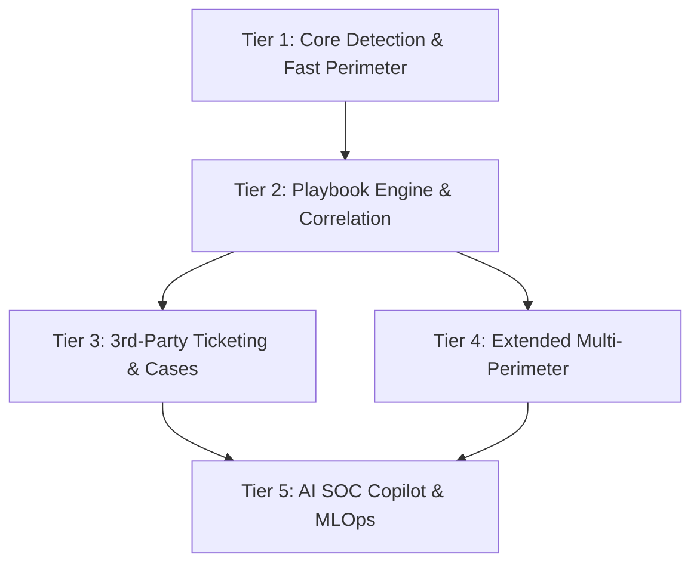

# MiniSOAR Overview

## 1. Tentang MiniSOAR

**MiniSOAR** (*Security Orchestration, Automation, and Response*) adalah platform orkestrator keamanan siber enterprise modular yang menggabungkan kecepatan pemrosesan log bervolume tinggi, analisis korelasi ancaman berbasis sliding-window, mesin playbook deklaratif, mitigasi perimeter terpadu, penahanan endpoint (EDR), integrasi ticketing pihak ketiga opsional, serta asisten AI SOC Copilot multi-provider.

MiniSOAR dirancang untuk menjembatani jurang antara deteksi insiden (*detection*) dan tindakan respons (*containment & mitigation*) secara real-time, meminimalkan **Mean Time to Detect (MTTD)** dan **Mean Time to Respond (MTTR)** dari hitungan jam menjadi hitungan detik.

---

## 2. Peta Kemampuan (Feature Roadmap & Tiers)

MiniSOAR mengimplementasikan arsitektur 5-Tier komprehensif:

### 🟢 Tier 1: Core Detection & Fast Perimeter
- **Logstash Ingestion Pipeline:** Normalisasi log HTTP/Proxy/WAF real-time dengan filter regex berkecepatan tinggi.
- **Perimeter Blockers:** Integrasi langsung ke WAF & Firewall utama:
  - **Palo Alto Networks:** Address Objects, Dynamic Address Groups (DAG), Security Rule commit.
  - **Imperva Cloud WAF:** Custom Rule Policy, Site IP ACL blocking.
  - **Akamai Kona Site Defender:** Network List activation & staging/production deployment.
- **Telegram Bot Interface:** Notifikasi interaktif instan untuk analis dengan inline action buttons.

### 🟡 Tier 2: Playbook Engine & Correlation
- **Declarative YAML Playbooks:** Workflow berbasis file YAML di `minisoar/playbooks/` yang dieksekusi secara terstruktur (Directed Acyclic Graph) dengan evaluasi kondisi AST aman (`SafeConditionEvaluator`).
- **Sliding-Window Correlation:** Agregasi hit serangan lintas waktu per-IP dan per-subnet menggunakan Redis sliding-window.
- **Anti-Alert Fatigue & Throttling:** Mencegah banjir notifikasi (*alert storm*) saat terjadi serangan DoS/Brute Force masif.
- **Multi-IP Campaign Detection:** Mendeteksi serangan terdistribusi yang menyasar endpoint kritis dari banyak IP berbeda.
- **EDR Server Integrations:**
  - **Kaspersky Security Center (KSC 15.1 OpenAPI):** Host network isolation, IoC repository synchronization, dan query asset.
  - **TrendMicro Cloud One & Vision One API:** Endpoint isolation, network suspension, dan response execution.

### 🟡 Tier 3: Case Management & Optional 3rd-Party Ticketing
- **Incident Lifecycle Management:** Status insiden standar (`NEW`, `INVESTIGATING`, `CONTAINED`, `RESOLVED`, `CLOSED`, `FALSE_POSITIVE`).
- **SLA & SOC Metrics:** Perhitungan otomatis MTTD, MTTR, dan tingkat kepatuhan SLA.
- **Executive Reporting:** Generator laporan insiden otomatis dalam format Markdown dan Standalone HTML.
- **Modular 3rd-Party Ticketing (100% Opsional):**
  - **TheHive 4/5:** Sinkronisasi case & IoC observable.
  - **Jira Service Management:** Pembuatan tiket insiden otomatis di project key yang ditentukan.
  - **ServiceNow Table API:** Pembuatan incident record dengan mapping otomatis Urgency & Impact.
  - **Generic Webhooks:** Integrasi fleksibel ke Zendesk, Freshservice, Slack, atau Microsoft Teams.

### 🟣 Tier 4: Extended Multi-Perimeter
- **Cloudflare Edge WAF:** Pemblokiran IP / range IP melalui Cloudflare IP Access Rules API.
- **Fortinet FortiOS Firewall:** Pengelolaan dynamic address object dan firewall address group melalui FortiOS REST API.
- **Unified Perimeter Router:** Satu perintah/aksi playbook dapat memicu mitigasi simultan ke seluruh lapisan perimeter (Cloud CDN Edge + Perimeter WAF + Datacenter Firewall).

### 🟣 Tier 5: AI SOC Copilot & Continuous MLOps
- **Multi-Provider AI Copilot SDK:** Mendukung Google Antigravity / Gemini SDK, Anthropic Claude SDK, OpenAI / Codex SDK, dan Local Ollama untuk SOC air-gapped.
- **Security Reasoning Capabilities:** Deobfuskasi skrip/payload serangan, pemetaan taktik & teknik MITRE ATT&CK, Root Cause Analysis (RCA), dan rekomendasi aturan mitigasi.
- **Flexible Auth File Resolution:** Mendukung API key langsung, Service Account JSON, OAuth token, atau berkas autentikasi pengguna (`chmod 600`).
- **Dual-Engine Processing:** Inferensi ML lokal sub-milidetik (`active_model.joblib`) untuk lalu lintas data real-time + LLM Copilot untuk investigasi mendalam.
- **Continuous Auto-Retraining (MLOps):** Pipeline otomatis yang melatih model Challenger dari label keputusan analis dengan Champion-Challenger Quality Gate (ROC-AUC $\ge 0.85$) dan zero-downtime hot-reloading.

---

## 3. Mode Operasi Blocking

MiniSOAR mendukung 4 mode operasi yang dapat diatur via variabel `MINISOAR_BLOCKING_MODE`:

1. **`AUTO`:** MiniSOAR langsung mengeksekusi mitigasi blokir ke perimeter jika rule/ML mendeteksi ancaman di atas ambang batas (High Severity). Notifikasi hasil eksekusi dikirimkan ke Telegram.
2. **`SEMI`:** MiniSOAR mengirimkan alert ke Telegram lengkap dengan tombol konfirmasi `[Block]` dan `[Ignore]`. Tindakan blokir baru dieksekusi setelah dikonfirmasi oleh analis.
3. **`MANUAL`:** MiniSOAR hanya mencatat insiden dan memberi rekomendasi. Tindakan blokir dilakukan secara manual oleh operator via command bot (`/block`).
4. **`PLAYBOOK`:** Keputusan respon sepenuhnya didelegasikan ke mesin playbook YAML deklaratif.
