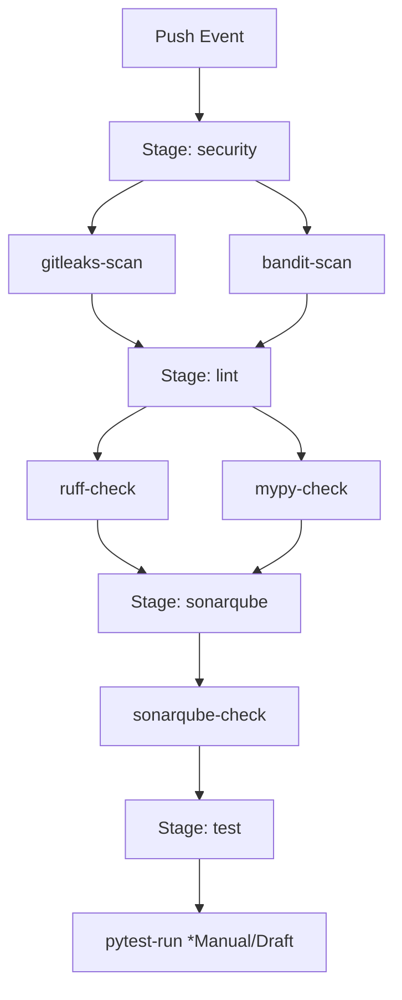
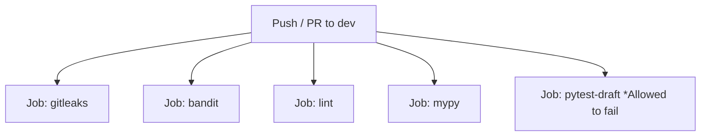

# Design Spec: MiniSOAR CI/CD Pipeline Enhancement

This document outlines the architecture, stages, and concrete configurations for enhancing the CI/CD pipelines of the MiniSOAR project on both GitLab CI/CD and GitHub Actions.

## Context & Requirements
MiniSOAR is a Python-based security orchestration, automation, and response (SOAR) application. Currently, the GitLab CI pipeline only has a SonarQube quality gate scan. To improve code quality, maintainability, and security, we are adding:
1. **Secret Scanning (Gitleaks)** to prevent credentials or tokens from being committed.
2. **Security Vulnerability Scanner (Bandit)** to identify Python security issues.
3. **Linter & Formatter Check (Ruff)** to enforce PEP8 standards efficiently.
4. **Static Type Checking (Mypy)** to check Python types.
5. **Unit Testing (Pytest - Draft/Manual)** as a non-blocking manual trigger before deployment.

We will provide configurations for both **GitLab CI/CD** (`.gitlab-ci.yml`) and **GitHub Actions** (`.github/workflows/ci.yml`).

---

## GitLab CI/CD Architecture

We implement a **Modular Stage Pipeline** to isolate responsibilities and allow quick feedback loops (fail-fast execution).



### 1. Stage: security
* **gitleaks-scan**: Scans the git repository history for committed secrets.
* **bandit-scan**: Performs static security analysis on the `minisoar/` package.

### 2. Stage: lint
* **ruff-check**: Rapidly checks style compliance and linting errors.
* **mypy-check**: Runs static type analysis using definitions from packages and stub files.

### 3. Stage: sonarqube
* **sonarqube-check**: Performs deep quality gate analysis (existing job).

### 4. Stage: test
* **pytest-run**: Draft test stage. Configured as `when: manual` and `allow_failure: true` to prevent blocking deployment or simulation flows.

---

## GitHub Actions Architecture

Similarly, for GitHub Actions we configure parallelized jobs. The pytest job uses `continue-on-error: true` to behave as a draft job.



---

## Configuration Files Spec

### GitLab CI (`.gitlab-ci.yml`)
```yaml
stages:
  - security
  - lint
  - sonarqube
  - test

# ==================== STAGE: SECURITY ====================

gitleaks-scan:
  stage: security
  image:
    name: zricethezav/gitleaks:latest
    entrypoint: [""]
  script:
    - gitleaks detect --verbose --source .

bandit-scan:
  stage: security
  image: python:3.10-slim
  script:
    - pip install bandit
    - bandit -r minisoar/

# ==================== STAGE: LINT ====================

ruff-check:
  stage: lint
  image: python:3.10-slim
  script:
    - pip install ruff
    - ruff check minisoar/
    - ruff format --check minisoar/

mypy-check:
  stage: lint
  image: python:3.10-slim
  script:
    - pip install -r requirements.txt
    - pip install mypy types-redis types-requests types-PyYAML
    - mypy minisoar/

# ==================== STAGE: SONARQUBE ====================

sonarqube-check:
  stage: sonarqube
  tags:
    - sonar-scanner
  image:
    name: sonarsource/sonar-scanner-cli:latest
    entrypoint: [""]
  variables:
    SONAR_USER_HOME: "${CI_PROJECT_DIR}/.sonar"
    GIT_DEPTH: "0"
  cache:
    key: "sonar-${CI_PROJECT_ID}"
    paths:
      - .sonar/cache
  script:
    - echo "SONAR_HOST_URL=${SONAR_HOST_URL}"
    - echo "SONAR_TOKEN_LENGTH=${#SONAR_TOKEN}"
    - |
      sonar-scanner \
        -Dsonar.host.url="${SONAR_HOST_URL}" \
        -Dsonar.token="${SONAR_TOKEN}" \
        -Dsonar.projectKey="${CI_PROJECT_PATH_SLUG}" \
        -Dsonar.projectName="${CI_PROJECT_PATH}" \
        -Dsonar.sources=. \
        -Dsonar.qualitygate.wait=true
  only:
    - dev

# ==================== STAGE: TEST (DRAFT) ====================

pytest-run:
  stage: test
  image: python:3.10-slim
  script:
    - pip install -r requirements.txt
    - pip install pytest
    - pytest
  rules:
    - when: manual
      allow_failure: true
```

### GitHub Action (`.github/workflows/ci.yml`)
```yaml
name: CI Pipeline

on:
  push:
    branches: [ dev ]
  pull_request:
    branches: [ dev ]

jobs:
  # ==================== JOBS: SECURITY ====================
  gitleaks:
    runs-on: ubuntu-latest
    steps:
      - name: Checkout Code
        uses: actions/checkout@v4
        with:
          fetch-depth: 0
      - name: Run Gitleaks
        uses: gitleaks/gitleaks-action@v2
        env:
          GITHUB_TOKEN: ${{ secrets.GITHUB_TOKEN }}

  bandit:
    runs-on: ubuntu-latest
    steps:
      - name: Checkout Code
        uses: actions/checkout@v4
      - name: Set up Python
        uses: actions/setup-python@v5
        with:
          python-version: '3.10'
      - name: Install Bandit
        run: pip install bandit
      - name: Run Bandit
        run: bandit -r minisoar/

  # ==================== JOBS: LINT ====================
  lint:
    runs-on: ubuntu-latest
    steps:
      - name: Checkout Code
        uses: actions/checkout@v4
      - name: Set up Python
        uses: actions/setup-python@v5
        with:
          python-version: '3.10'
      - name: Install Ruff
        run: pip install ruff
      - name: Run Ruff Check
        run: ruff check minisoar/
      - name: Run Ruff Format Check
        run: ruff format --check minisoar/

  mypy:
    runs-on: ubuntu-latest
    steps:
      - name: Checkout Code
        uses: actions/checkout@v4
      - name: Set up Python
        uses: actions/setup-python@v5
        with:
          python-version: '3.10'
          cache: 'pip'
      - name: Install Dependencies
        run: |
          pip install -r requirements.txt
          pip install mypy types-redis types-requests types-PyYAML
      - name: Run Mypy
        run: mypy minisoar/

  # ==================== JOBS: TEST (DRAFT) ====================
  pytest-draft:
    runs-on: ubuntu-latest
    steps:
      - name: Checkout Code
        uses: actions/checkout@v4
      - name: Set up Python
        uses: actions/setup-python@v5
        with:
          python-version: '3.10'
      - name: Install Dependencies
        run: |
          pip install -r requirements.txt
          pip install pytest
      - name: Run Pytest (Draft)
        run: pytest
        continue-on-error: true
```
